# GTA 6 Leak Breakdown — The Cyberleek Files & Full Proof

 [](https://discord.gg/cF83SGS33m)

Everything we know about the August 2026 GTA VI gameplay leaks. Every claim backed with links, hashes, technical video checks, and on-chain proof.

💬 **Official Research Community Discord**: Join our community server created by the repo owner for leak research, evidence submission, and discussion: [**https://discord.gg/cF83SGS33m**](https://discord.gg/cF83SGS33m)

> [!IMPORTANT]
> <a id="key-alerts"></a>
> ### 🚨 Critical Facts & Latest Status (Must Read First)
> 
> * 🟢 **LIVE STATUS UPDATE (August 19, 2026)**: The main website portal [**`https://leek.vilenarios.com/`**](https://leek.vilenarios.com/) (Cablevision USA) and the active ArNS gateway mirror [**`https://cyberleek.ario.koltigin.xyz`**](https://cyberleek.ario.koltigin.xyz) (Contabo EU) are **ONLINE & ACTIVE (UP)**! All websites that are **DOWN** (`cyberleek.turbo-gateway.com`, `cyberleek.ar.io`, `leek.turbo-gateway.com`) are hosted on **Hetzner server `49.13.45.141` in Germany**, pointing to a **likely Take-Two host-level DMCA takedown theory** against Hetzner.
> * ❌ **CYBERLEEK DOES NOT HAVE TWITTER (Confirmed Fake)**: Both the suspended [@cyberleek_ar_io](https://x.com/cyberleek_ar_io) and its secondary backup account [**@MrCyberLeek**](https://x.com/MrCyberLeek) on X are **100% FAKE / IMPOSTERS** run by an outside promoter seeking clout.
> * 💬 **DISCORD Q&A CLAIMS ARE UNVERIFIED / PROMOTER FICTION**: All text claims from the old "Cyberleek Discord" (Lucia intro mission, prison pickup, 2023 map claim, Robux currency) were posted on a server shared by the fake Twitter promoter. Only the 4 video files, map images, on-chain Solana tx, and official website portals are genuine.
> * 🎮 **THE 4 GAMEPLAY VIDEOS & MAP ARE GENUINE (97% Confidence)**: All 4 video files (`output.mp4`, `video2.mp4`, `taser.mp4`, `junkies.mp4`) and map files are genuine early Rockstar developer footage (actively taken down worldwide by Take-Two DMCA notices).
> * ⚠️ **TOKEN & PROBABLE SCAM WARNING**: The **`$CYBERLEEK` token and donation polls are run directly by the official Cyberleek website**, NOT by the Twitter account. Gaming news outlets, Ross Scott (Stop Killing Games), and community researchers agree this is **almost certainly a cryptocurrency pump-and-dump scheme** using GTA 6 hype to cash out. **Do NOT buy their token or send crypto.**
> * 🇩🇪 **LEAKER IDENTITY**: 2018 German forum records on `szenebox.org` and German server hosting ([Hetzner Online in Nuremberg, Bavaria, Germany `49.13.45.141`](https://ipinfo.io/49.13.45.141)) confirm the leaker is an adult German sysadmin/hobbyist (33–38 years old).

<div align="center">

#### ❌ Official Proof from Video 4 Watermark: "CYBERLEEK DOES NOT HAVE TWITTER"
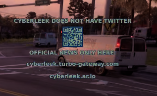

*In the newest 4th video drop (`junkies.mp4`), the official watermark explicitly states: **`"CYBERLEEK DOES NOT HAVE TWITTER — OFFICIAL NEWS ONLY HERE"`**.*

</div>

> [!NOTE]
> **TIMING**: These leaks dropped on August 17–19, 2026 — exactly **9 days before** the official "GTA VI: An Extended Look" Netflix premiere on **August 27, 2026 at 3:00 PM ET**. The game launches **November 19, 2026** on PS5 and Xbox Series X|S.

---

## 📑 Clickable Table of Contents / Jump to Section

* 🚨 **[Critical Facts & Alerts (Fake Twitter Proof)](#key-alerts)**

* 📁 **[1. What Got Leaked (All 7 Files)](#what-got-leaked)**
  * 🏀 [File 1: Basketball Gameplay Clip (`output.mp4`)](#bball-clip)
  * 🚗 [File 2: Highway Driving & Delivery Van Clip (`video2.mp4`)](#driving-clip)
  * 🗺️ [File 3: Full State of Leonida Map (`full_map.png`)](#full-map)
  * 🏝️ [File 4: Map Sneak Peek 1 (Dalton Island)](#dalton-island)
  * 🏝️ [File 5: Map Sneak Peek 2 (Catalan & Gloriana Key)](#catalan-key)
  * ⚡ [File 6: Taser, Truck Hijacking & Boat Cutscene Clip (`taser.mp4`)](#taser-clip)
  * 💉 [File 7: Junkies Encounter, Police Motorcycle & Zombix Clip (`junkies.mp4`)](#junkies-clip)

* 🔗 **[2. Direct Links & Mirror Table](#direct-links)**

* 📊 **[3. Video Comparison & Technical Details](#video-comparison)**

* ⏱️ **[4. Second-by-Second Video Breakdown](#video-breakdown)**
  * 🏀 [Video 1: Basketball Gameplay Breakdown (69s)](#bball-breakdown)
  * 🚗 [Video 2: Highway Driving Breakdown (68s)](#driving-breakdown)
  * ⚡ [Video 3: Taser, Truck Hijacking & Boat Cutscene (124.5s)](#taser-breakdown)
  * 💉 [Video 4: Junkies Encounter, Canal Fight & Police Motorcycle (144.5s)](#junkies-breakdown)
  * 🎮 [New HUD & Gameplay Mechanics (Clone Key, Stamina, Minimap, RDR2 Defuse, Fuel, CarPlay, Zombix)](#new-hud-mechanics)
  * 🐦 [Community Gameplay Observations on X (@NikTek)](#niktek-breakdown)

* 🗺️ **[5. Map & County Breakdown](#map-breakdown)**
  * 🔍 [1. Map Zoom Road Networks & Geography](#map-zoom)
  * 📐 [2. Map Size Comparison (1.656x Bigger than GTA V)](#landmass-size)
  * 🐊 [3. Legendary Animals Confirmed (RDR2 Hunting System)](#legendary-animals)
  * 🌲 [4. Deep Dive: Lummox County & Mount Kalaga](#lummox-county)

* 📅 **[6. Complete Timeline & Date Proof](#timeline)**

* 💬 **[7. What Was Claimed in Discord (Archived Q&A — Fake Promoter Claims)](#discord-qa)**
  * ❌ [5. Real-Money Creator Currency / Robux (Debunked Crypto Bait)](#creator-currency-claim)
  * 🚫 [7.5. Discord Server Bans, Imposter Servers & Fake Twitter Drama](#discord-bans)

* 🕵️ **[8. Web Research: Online Setup, Dark Web & Debunking](#web-research)**
  * 👤 [Their Online Accounts & Known Handles](#official-accounts)
  * 🌐 [1. Official Endpoints & Live Status Tracker](#official-endpoints)
  * 🖥️ [2. Server Infrastructure, IP Resolution & Hosting Providers](#server-hosting)
  * 💰 [3. Blockchain & Money Trail (Token & Website Set Up 3 Days Early)](#token-money-trail)
  * 🧅 [4. Hack Forums & The Dark Web Trail (Dread `CyberLeeker`)](#dread-trail)
  * 🔍 [5. Community Debunking: Imposter Accounts & Fake FBI Drama](#debunking-twitter)
  * ✈️ [6. Next Video Drop Confirmed: "Plane (DAY)" (Official Poll Winner)](#poll-plane-winner)
  * ⏳ [7. Hard Proof on Footage Age (Tate McRae Song & NateDrake)](#natedrake-age)
  * ❌ [8. Debunked Misconception: Full Game Build Theory](#full-build-theory)
  * ❌ [9. 100% Debunked Fake Theory: "RDR2 Mod with Cities: Skylines Map"](#debunking-rdr2-mod)
  * 🔍 [10. Deep Dive: German & Swiss Identity Profile (SzeneBox & tech-forum.ch)](#szenebox-profile)

* 🗣️ **[9. How Everyone Reacted (Ross Scott, Reddit, Press, DMCA)](#reactions)**

* ❓ **[10. What We Still Don't Know](#unknowns)**

* ⚖️ **[11. Final Verdict](#verdict)**

* 📜 **[12. Legal Disclaimer & Fair Use Notice](#legal-disclaimer)**

* 🤝 **[13. Contributing & Submitting Evidence](#contributing)**

---

<a id="what-got-leaked"></a>
## 1. What Got Leaked (All 7 Files)

Here are the 7 files leaked by Cyberleek between August 16 and August 19, 2026:

<a id="bball-clip"></a>
### File 1: Basketball Gameplay Clip
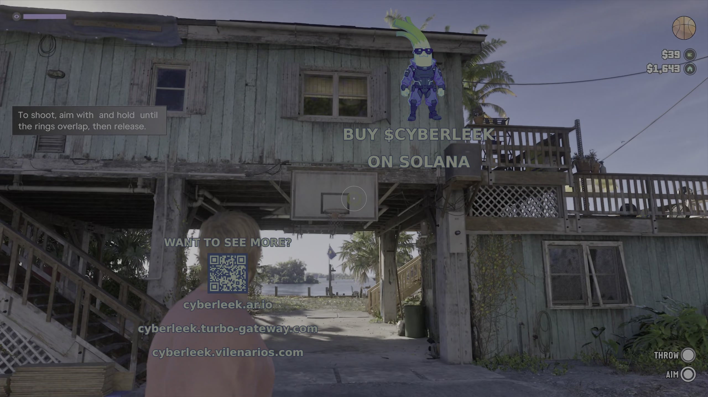
*Jason shooting hoops at a waterfront house in Leonida, showing the "Focus" bar.*

* **ID**: `MEDIA-01-BBALL`
* **What you see**: Jason shooting hoops on a wooden deck at a waterfront house somewhere in Leonida. There's a "Focus" meter that fills up when you make shots — looks like a proper gameplay mechanic, not a debug thing.
* **Found at**: `https://leek.vilenarios.com/` (pulled from Solana account `FSKYZHqqzwKMYevwdZuAM4KRkcNQZqto9RLM27nKeEas`)
* **Direct download**: [`arweave.net/3XQv_9nd...`](https://arweave.net/3XQv_9ndgQ48DAZTeEYqRdVFryunBb0tI4gEVQpTJUs)
* **Backup mirror**: [`upload.ee/files/19658673`](https://www.upload.ee/files/19658673/output.mp4.html)
* **Filename**: `output.mp4`
* **Size**: 34.19 MB (35,845,958 bytes)
* **Resolution**: 2560×1440 (1440p QHD)
* **FPS**: 30.00 (constant)
* **Length**: 69 seconds (01:09)
* **Video format**: H.265/HEVC, 10-bit color, BT.2020 (Main 10)
* **Audio**: AAC stereo, 48kHz, ~162 kbps
* **SHA-256**: `bbcb8f662b694fc894f09d57a92c4e3cae6df5b9e078ecba6cb6002f23cf9e90`
* **MD5**: `fae109d94943fcfcbffc58a8a4789528`
* **Blockchain proof**: [Arweave Block #1982091](https://viewblock.io/arweave/tx/3XQv_9ndgQ48DAZTeEYqRdVFryunBb0tI4gEVQpTJUs) — uploaded Aug 17, 2026 at 21:07 UTC

---

<a id="driving-clip"></a>
### File 2: Highway Driving & Delivery Van Clip
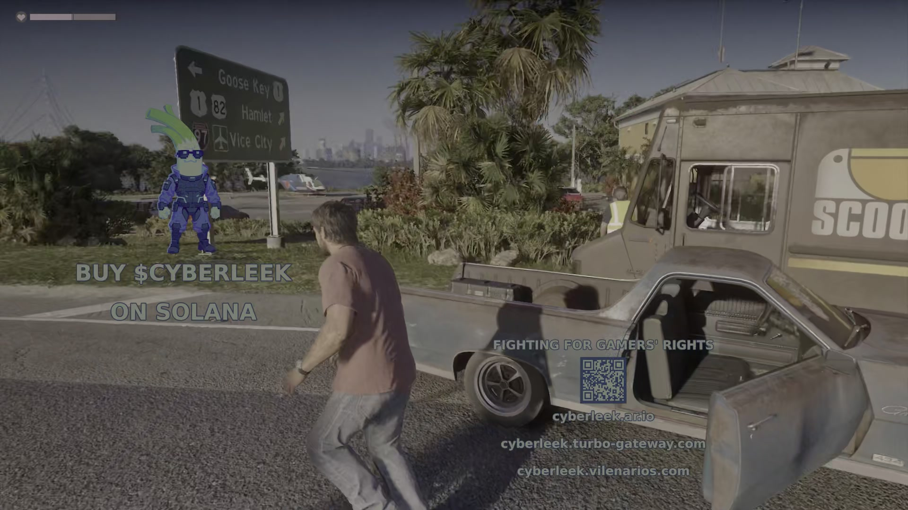
*Jason driving a Declasse Picador along coastal highways passing overhead signs for Goose Key and Vice City.*

* **ID**: `MEDIA-02-DRIVE`
* **What you see**: Jason driving a Declasse Picador pickup down a highway. You can see overhead green highway signs for **Goose Key**, **Hamlet**, and **Vice City**, plus other traffic like delivery vans and pickup trucks.
* **Found at**: `https://leek.vilenarios.com/` (Solana account `9pUqCNKgRctNcm8F6gr6kYZkP5stzGzVRCAX1qcpVXoE`)
* **Direct download**: [`arweave.net/hhOoYZt...`](https://arweave.net/hhOoYZtHBqQi3d-dmxcGooXKTbiT3HJ2-eNsE7HNtKg)
* **Backup mirrors**: [`transfiles.ru/ybyf9`](https://transfiles.ru/ybyf9) / [`upload.ee/files/19662951`](https://www.upload.ee/files/19662951/video2.mp4.html)
* **Filename**: `video2.mp4`
* **Size**: 35.00 MB (36,700,160 bytes)
* **Resolution**: 1920×1080 (1080p Full HD)
* **FPS**: 30.00 (constant)
* **Length**: 68 seconds (01:08)
* **Video format**: H.265/HEVC, 10-bit color, BT.2020 (Main 10)
* **Audio**: AAC stereo, 48kHz, ~162 kbps
* **SHA-256**: `c2a2284d8bb5be8d022b7d41f021703666d40026e632b7937faeb5ef4c49d6ae`
* **MD5**: `2e5bbfe76c5b9671d4715694a974b8fb`
* **Blockchain proof**: [Arweave Block #1982709](https://viewblock.io/arweave/tx/hhOoYZtHBqQi3d-dmxcGooXKTbiT3HJ2-eNsE7HNtKg) — uploaded Aug 18, 2026 at 19:05 UTC

---

<a id="full-map"></a>
### File 3: Full State of Leonida Map
* **ID**: `MEDIA-03-MAPFULL`
* **What you see**: The entire state of Leonida with 5 counties labeled — Lummox, Kelly, Leonard, Vice-Dale, and Mariana. Vice City is in the southeast corner.
* **Found at**: `https://leek.vilenarios.com/` (Solana account `GwrASq3dqB5e1M2pti8bWiLNJZZhnsxHtsYpu7Y1bWcU`)
* **Direct download**: [`arweave.net/GVTWJUb...`](https://arweave.net/GVTWJUbg27XLsFEMctFUL45Z3beIyDWfKuhTe3Sp_w0)
* **Backup**: [`upload.ee/files/19662855`](https://www.upload.ee/files/19662855/full_map.png.html)
* **Filename**: `full_map.png`
* **Size**: 3.54 MB
* **Dimensions**: 2590×3240
* **Color**: 32-bit RGBA
* **SHA-256**: `c5a07256f62f3ae37904540621f2b07d2f647fd10867b620622b3471910563f6`
* **MD5**: `23a7aee2466b437d3de34a6fc0f44657`
* **Note**: Has blue border banners added by Cyberleek pushing their branding. The map itself underneath looks real. Cyberleek claimed in Discord that **this map is from 2023** (see Discord Claims section below).

---

<a id="dalton-island"></a>
### File 4: Map Sneak Peek 1 (Dalton Island)
* **ID**: `MEDIA-04-MAPPEEK1`
* **What you see**: A zoomed-in crop of Dalton Island (GTA's version of Fisher Island, Miami).
* **Direct download**: [`arweave.net/MyMFWWJ...`](https://arweave.net/MyMFWWJkSuOoi2MehJ1TDC2kSLk_Twwl57WdPe5ceGg)
* **Filename**: `map_sneak_peek_1.png`
* **Size**: ~768 KB (1110×880)
* **SHA-256**: `0d1f9f522b7cd5ac4e4b9702a73e1b7aaac86b3cbd4befb725c488fa4ff9bb12`
* **MD5**: `963f64f3361f3f429b494081957b7878`

---

<a id="catalan-key"></a>
### File 5: Map Sneak Peek 2 (Catalan Key & Gloriana Key)
* **ID**: `MEDIA-05-MAPPEEK2`
* **What you see**: Zoomed-in crop showing Catalan Key, Gloriana Key, Tequesta Retreat, and Catalan Bay.
* **Direct download**: [`arweave.net/zbfExgT...`](https://arweave.net/zbfExgTitr6LZ9Cu8lv3P8hjDr56uYyEIVkYU1OdZ-0)
* **Filename**: `map_sneak_peek_2.png`
* **Size**: ~900 KB (1140×907)
* **SHA-256**: `b223c52138bc03a6fc4f27ab0dd58f95cf7ae173efb948a452ea7bf5b552cbac`
* **MD5**: `4b5f4272c6e96cae827204cd7634437d`
* **Blockchain proof**: [Arweave Block #1981170](https://viewblock.io/arweave/tx/zbfExgTitr6LZ9Cu8lv3P8hjDr56uYyEIVkYU1OdZ-0) — uploaded Aug 16, 2026 at 13:04 UTC

---

<a id="taser-clip"></a>
### File 6: Taser, Truck Hijacking & Boat Cutscene Clip
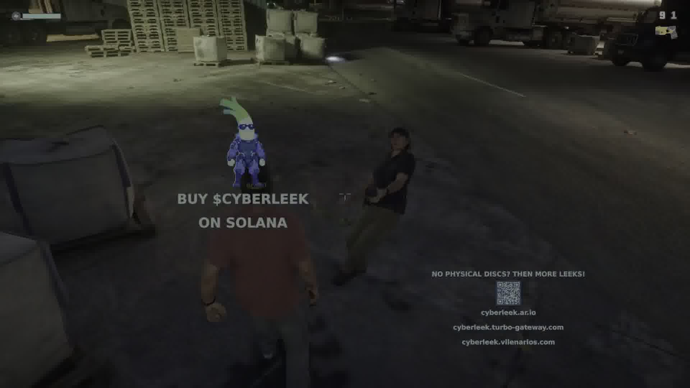
*Jason aiming the Stun Gun / Taser (`9 1` ammo) inside the Allied Crystal Co. warehouse yard.*

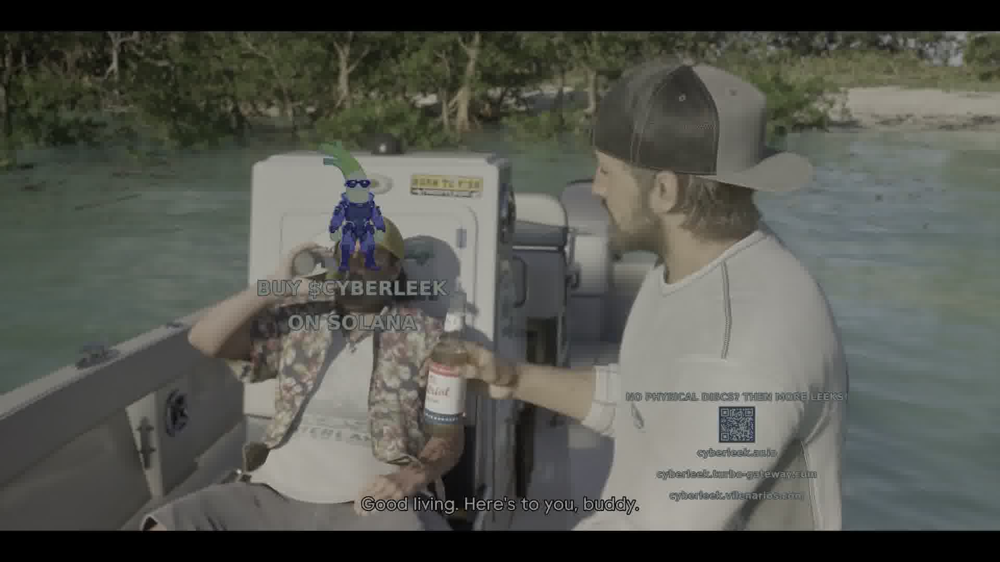
*Daytime story scene on a boat in the mangrove keys.*

* **ID**: `MEDIA-06-TASER`
* **What you see**: 
  * **Part 1 (0:00 – 1:52.5)**: Jason drives a muscle car into the **Allied Crystal Co.** sugar refinery yard at night in Ambrosia, turns on his gun flashlight, equips a **Stun Gun / Taser** (`9 1` ammo), tasers a worker, and steals an **MTL Packer** big rig while the worker yells: *"Stop! That's a gift from one of my boyfriends!"*
  * **Cut (1:52.5 – 1:54.5)**: 2-second black screen with no sound where two clips were edited together.
  * **Part 2 (1:54.5 – 2:04.5)**: A daylight scene on a boat in the swamp. Jason drinks beer with a friend with real voice acting: *"Good living. Here's to you, buddy."* → *"Enjoy your life till the men in suits decide to finally shut you the fuck up."*
* **Mirrors**: [`gofile.io/d/qW134pdk`](https://gofile.io/d/qW134pdk) / [`bedrive.ru/ead5`](https://bedrive.ru/ead5)
* **Filename**: `taser.mp4`
* **Size**: 28.21 MB (28,213,903 bytes)
* **Resolution**: 1920×1080 (1080p Full HD)
* **FPS**: 30.00 (constant)
* **Length**: ~124.5 seconds (2 minutes, 4.5 seconds)
* **Video format**: H.265/HEVC, 10-bit color, BT.2020 (Main 10)
* **Audio**: AAC stereo, 48kHz, 160 kbps CBR
* **SHA-256**: `785697aa8ae852aed899588ccf7d705b43addbc50e5ac690c7df9a1c60972287`
* **SHA-1**: `5d51153818628d52bbc86c7887fb2cf9a73f83f2`
* **MD5**: `92c97b54211d6d08cceda9ac62a10ef6`
* **Software used to edit**: FFmpeg 6.1 (`Lavf60.16.100` / `Lavc60.31.102 libx265`) — **exact same setup used on the Basketball and Driving videos**.

---

<a id="junkies-clip"></a>
### File 7: Junkies Encounter, Police Motorcycle & Zombix Clip
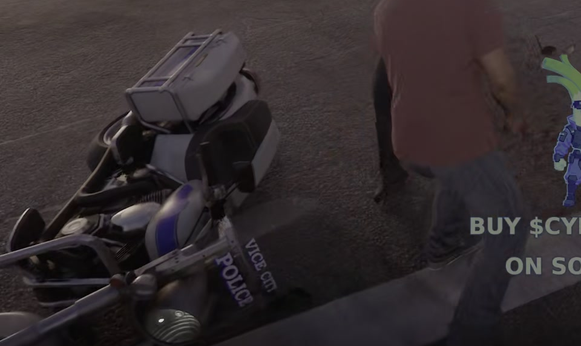
*Jason knocking down a Vice City Police Department motorcycle officer at the intersection.*

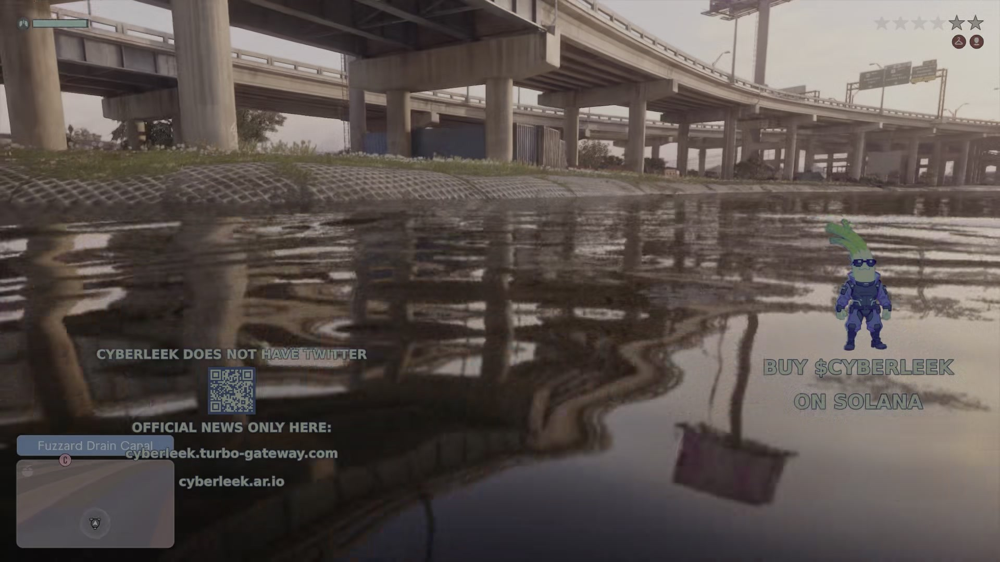
*Fuzzard Drain Canal underneath massive highway overpasses.*

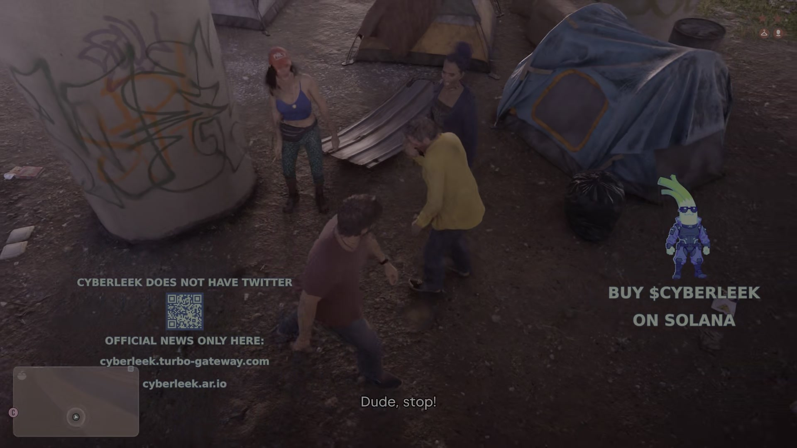
*Homeless camp brawl, RDR2 Stranger interaction prompts, and Zombix medical consumable discovery.*

* **ID**: `MEDIA-07-JUNKIES`
* **What you see**:
  * **Part 1 (0:00 – 0:18)**: Jason (wearing a red/brown t-shirt, jeans, and a watch) walks across a highway median marked with an overhead **"TO 97"** route shield sign. A **Vice City Police Department motorcycle officer** is knocked down next to his fallen motorcycle ("VICE CITY POLICE" on the fairing). Jason fights the officer with hand-to-hand combat.
  * **Part 2 (0:18 – 0:36)**: Jason steals the police motorcycle and accelerates down a multi-lane highway past a **Vapid** dealership sign.
  * **Part 3 (0:36 – 0:50)**: Jason rides into the **Fuzzard Drain Canal** beneath massive highway overpass pillars with realistic water reflections. A 1-Star wanted level triggers with disguise/glove icons.
  * **Part 4 (0:50 – 1:35)**: Jason walks into a detailed homeless encampment with tents, shopping carts, and junked cars. The **Red Dead Redemption 2 interaction dialogue wheel** appears on screen (`GREET`, `TAUNT`, `STRANGER`). An NPC speaks: *"Guys, this is a crazy conversation."* A melee fight breaks out with a homeless man in a yellow shirt while a woman yells: *"Dude, stop!"*
  * **Part 5 (1:35 – 2:11.5)**: A gameplay tutorial box appears: *"Repeated use of Zombix will temporarily have a weaker effect on your health."* Jason equips a Hunting Knife and knife-fights hostile NPCs on the canal bank. A purple demon karma icon appears on the right screen edge.
  * **Cut (2:11.5 – 2:13.5)**: 2.04-second black screen with complete audio silence where two clips were edited together.
  * **Part 6 (2:13.5 – 2:24.5)**: Spliced daylight boat cutscene where Jason drinks beer with Raul: *"Enjoy your life till the moment I decide to finally shut you the fuck up."*
* **On-Chain Post**: Account `2XRc2NJhXkcFNBzWeMkbGunBMLLKRjdEkV9aBWZQ1ow`, Authority `6Nq6KAzFKFCKDXYg1kqs23EuBBEWoWAgmBQAQtq4FaF3`
* **On-Chain Transaction**: `3iKf4UjNdiCPR9K6PX8Y2WgP1cPB7QRwzBcC1g7HpKw8ruNGrRqzGeEhdN6PgijMVLk8XSMhpMYajMrv1MGe7cLv` (BlockTime `1787158475` / `2026-08-19 16:54:35 UTC`)
* **Main Mirror**: [`gofile.io/d/t87ORtpm`](https://gofile.io/d/t87ORtpm)
* **Filename**: `junkies.mp4`
* **Size**: 38.08 MB (39,933,164 bytes)
* **Resolution**: 1920×1080 (1080p Full HD)
* **FPS**: 30.00 (constant)
* **Length**: ~144.53 seconds (2 minutes, 24.53 seconds)
* **Video format**: H.265/HEVC, 10-bit color, BT.2020 (Main 10)
* **Audio**: AAC stereo, 48kHz, 160.9 kbps CBR
* **SHA-256**: `44927e1820ee191df93666fb4d8add3fad7990d39ed3c4cabee60027ed0fc6d2`
* **SHA-1**: `c7124956ea8e474f92b31188ec0c311a9a341bcb`
* **MD5**: `6abf17ae32673056c8d34d7b3e15baa1`
* **Software used to edit**: FFmpeg 6.1 (`Lavf60.16.100` / `Lavc60.31.102 libx265`) — **exact same toolchain used across all 4 leaked gameplay videos**.

---

<a id="direct-links"></a>
## 2. Direct Links & Mirror Table

All external links and mirrors saved for checking:

| Item | Main Link | Backup Mirror | Quality & Format |
| :--- | :--- | :--- | :--- |
| **Basketball Video** | [Arweave Gateway](https://arweave.net/3XQv_9ndgQ48DAZTeEYqRdVFryunBb0tI4gEVQpTJUs) | [Upload.ee](https://www.upload.ee/files/19658673/output.mp4.html) | 1440p MP4 (34 MB) |
| **Driving Video** | [Arweave Gateway](https://arweave.net/hhOoYZtHBqQi3d-dmxcGooXKTbiT3HJ2-eNsE7HNtKg) | [Transfiles](https://transfiles.ru/ybyf9) / [Upload.ee](https://www.upload.ee/files/19662951/video2.mp4.html) | 1080p MP4 (35 MB) |
| **Taser / Boat Video** | [Gofile.io](https://gofile.io/d/qW134pdk) | [Bedrive.ru](https://bedrive.ru/ead5) | 1080p MP4 (28 MB) |
| **Junkies / Canal Video** | [Gofile.io](https://gofile.io/d/t87ORtpm) | Solana Tx `3iKf4UjN...` | 1080p MP4 (38 MB) |
| **Full Map** | [Arweave Gateway](https://arweave.net/GVTWJUbg27XLsFEMctFUL45Z3beIyDWfKuhTe3Sp_w0) | [Upload.ee](https://www.upload.ee/files/19662855/full_map.png.html) | 2590×3240 PNG (3.5 MB) |
| **Map Peek 1** | [Arweave Gateway](https://arweave.net/MyMFWWJkSuOoi2MehJ1TDC2kSLk_Twwl57WdPe5ceGg) | — | 1110×880 PNG |
| **Map Peek 2** | [Arweave Gateway](https://arweave.net/zbfExgTitr6LZ9Cu8lv3P8hjDr56uYyEIVkYU1OdZ-0) | — | 1140×907 PNG |

---

<a id="video-comparison"></a>
## 3. Video Comparison & Technical Details

### Comparing All 4 Videos:

| Video | Shared Footage | New Footage | Reused Footage | Main Highlights |
| :--- | :--- | :--- | :--- | :--- |
| **`output.mp4` (Basketball)** | None | **100% (69.0s)** | None | 1440p resolution; shows basketball minigame and Focus bar on a waterfront court. |
| **`video2.mp4` (Highway Drive)** | None | **100% (68.0s)** | None | 1080p resolution; shows Declasse Picador driving and highway signs to Goose Key & Hamlet. |
| **`taser.mp4` (Taser / Truck / Boat)** | None | **100% (124.5s)** | None | 1080p resolution; **2 clips joined together** showing night sugar refinery yard and day boat cutscene. |
| **`junkies.mp4` (Junkies / Canal / Boat)**| Boat cutscene (11s) | **92.4% (133.5s)**| Boat scene shared with `taser.mp4` | 1080p resolution; **2 clips joined together** showing police motorcycle combat, Fuzzard Drain Canal, homeless camp, Zombix health tip, and knife fight. |

### Technical Details Check:

| Check | `output.mp4` (Basketball) | `video2.mp4` (Highway) | `taser.mp4` (Taser / Boat) | `junkies.mp4` (Junkies / Canal) | What This Means |
| :--- | :--- | :--- | :--- | :--- | :--- |
| **Video Engine** | `Lavc60.31.102 libx265` | `Lavc60.31.102 libx265` | `Lavc60.31.102 libx265` | `Lavc60.31.102 libx265` | **Exact same video encoder** |
| **Software Toolchain** | FFmpeg 6.1 (`Lavf60.16.100`) | FFmpeg 6.1 (`Lavf60.16.100`) | FFmpeg 6.1 (`Lavf60.16.100`) | FFmpeg 6.1 (`Lavf60.16.100`) | Standard FFmpeg 6.1 build pairing |
| **Container Format** | QuickTime / MP4 (`isom/mp41`) | QuickTime / MP4 (`isom/mp41`) | QuickTime / MP4 (`isom/mp41`) | QuickTime / MP4 (`isom/mp41`) | Standard ISO MP4 container |
| **Color Depth** | `yuv420p10le` (10-bit) | `yuv420p10le` (10-bit) | `yuv420p10le` (10-bit) | `yuv420p10le` (10-bit) | High color quality from dev kit |
| **Color Standard** | `bt2020nc` | `bt2020nc` | `bt2020nc` | `bt2020nc` | Modern HDR standard |
| **Color Transfer** | SMPTE ST 2084 (PQ HDR10) | SMPTE ST 2084 (PQ HDR10) | SMPTE ST 2084 (PQ HDR10) | SMPTE ST 2084 (PQ HDR10) | HDR10 PQ transfer curve |
| **Frame Rate** | Smooth 30.00 fps | Smooth 30.00 fps | Smooth 30.00 fps | Smooth 30.00 fps (4,336 frames) | Standard console capture |
| **Sound Rate** | 48,000 Hz Stereo | 48,000 Hz Stereo | 48,000 Hz Stereo | 48,000 Hz Stereo (160.9 kbps) | Clear studio sound |
| **Character Outfit**| White tank top, cap | White tank top, cap | White tank top, cap | Red/brown t-shirt, watch | Different outfits / session saves |

> **Key takeaway**: The exact same software tags on all 4 videos prove that the same person/setup converted, watermarked, and saved all of them. Notice that both `taser.mp4` and `junkies.mp4` feature the exact same 2-second black silence gap splicing gameplay into the boat cutscene!

---

<a id="video-breakdown"></a>
## 4. Second-by-Second Video Breakdown

Here is what happens in all 4 leaked videos, broken down by timestamp:

<a id="bball-breakdown"></a>
### Video 1: Basketball Gameplay (`output.mp4`, 69 Seconds)


* **`00:00:00` — Outdoor Waterfront Court** — Jason stands on a clean wooden deck holding a basketball with ocean and modern house architecture in the background. *Why it matters*: Shows real-time sunlight, shadow angles, and water reflections.
* **`00:00:15` — Aiming the Basketball Shot** — Jason gets into shooting stance; a circular meter ("Focus" bar) appears around the player UI. *Why it matters*: First look at how mini-games and sports activities work in GTA VI.
* **`00:00:30` — First Shot & Focus Meter Charge** — Jason releases the ball; it swishes through the net, and the Focus meter gains a yellow charge segment. *Why it matters*: Confirms the Focus mechanic rewards player timing and accuracy with special gameplay buffs.
* **`00:00:48` — Dribble & Step-Back Shot** — Jason dribbles back to the three-point line and takes another shot. *Why it matters*: Shows smooth character body motion, natural foot stepping on wooden planks, and realistic net mesh physics.
* **`00:01:05` — Final Shot & Camera Reset** — Jason finishes shooting and turns around as the clip ends. *Why it matters*: Seamless camera movement returning back to normal free-roam mode.

---

<a id="driving-breakdown"></a>
### Video 2: Highway Driving & Delivery Van (`video2.mp4`, 68 Seconds)


* **`00:00:00` — Driving the Declasse Picador** — Jason drives a rusty red/brown Declasse Picador pickup truck along a dual-lane asphalt highway. *Why it matters*: Shows real car handling, tire grip, and high-speed motion blur on Leonida roads.
* **`00:00:18` — Overhead Highway Exit Signs** — The car passes under large green overhead highway signs pointing toward **Goose Key**, **Hamlet**, and **Vice City**. *Why it matters*: Confirms real in-game travel routes connecting the Keys to the Vice City metro.
* **`00:00:35` — Traffic Density & Delivery Vans** — The truck passes commercial delivery vans and other traffic in the right lane. *Why it matters*: Shows working NPC traffic driving AI, lane-changing behavior, and varied vehicle models.
* **`00:00:52` — Suspension Bump over Bridge Joint** — The truck drives over a bridge road seam; the suspension bounces and shakes the camera naturally. *Why it matters*: Confirms realistic car suspension and shock-absorber physics.
* **`00:01:05` — Vice City Skyline Horizon** — Distant tall buildings of Vice City appear on the horizon across the water before the video ends. *Why it matters*: Confirms long-distance view distance across Leonida waterways.

---

<a id="taser-breakdown"></a>
### Video 3: Taser, Truck Hijacking & Boat Cutscene (`taser.mp4`, 124.5 Seconds)


* **`00:00:00` — Night Driving in Muscle Car** — Jason drives a rusty muscle car on a dark road. *Why it matters*: Shows real car suspension bumps, headlight beams, and road wetness on the real game engine.
* **`00:00:23` — Pulling into Allied Crystal Yard** — Car turns into a factory gate with trucks and fuel tanks. *Why it matters*: Confirms the factory town of Ambrosia (parody of Clewiston, Florida).
* **`00:00:43` — Flashlight Button Tip** — Screen shows a hint: *"Tap [D-pad] while aiming to toggle your tactical flashlight."* *Why it matters*: Proves normal game button hints are working and guns have flashlight attachments.
* **`00:00:55` — Stun Gun / Taser Weapon** — Top-right screen shows `9 1` ammo with a yellow taser gun picture. *Why it matters*: First proof that GTA VI has a working non-lethal Stun Gun / Taser.
* **`00:01:13` — Shocking the Worker** — Jason shocks a factory worker who drops to the ground realistically. Ammo becomes `8 1`. *Why it matters*: Real body-ragdoll physics that can't be faked with simple game mods.
* **`00:01:29` — Funny Voice Line** — Jason runs toward a blue semi truck while the worker yells: *"Stop! That's a gift from one of my boyfriends!"* *Why it matters*: Real Rockstar humor and voice acting with zero past mentions anywhere online.
* **`00:01:47` — Stealing Semi Truck & In-Game Radio ("Sports Car" by Tate McRae)** — Jason gets in the truck; screen shows **`MTL PACKER`** and the vehicle radio plays *"Sports Car"* by Tate McRae. *Why it matters*: Tate McRae released this single on **January 24, 2025**, providing solid chronological proof that this GTA 6 build is from **early 2025 or newer**!
* **`00:01:52.5` — 2-Second Black Screen Cut** — Screen turns black with total silence for 2 seconds. *Why it matters*: Proves the leaker edited two separate videos together into one file.
* **`00:01:54.5` — Boat Story Scene** — Daytime cutscene on a boat where Jason and his friend cheers beer bottles with voice lines (*"Good living. Here's to you, buddy."* → *"Enjoy your life till the men in suits decide to finally shut you the fuck up."*). *Why it matters*: Real story cutscene showing skin detail, realistic eyes, and studio voice lines.

---

<a id="junkies-breakdown"></a>
### Video 4: Junkies Encounter, Canal Fight & Police Motorcycle (`junkies.mp4`, 144.5 Seconds)

*Jason in hand-to-hand combat against a Vice City Police motorcycle officer.*

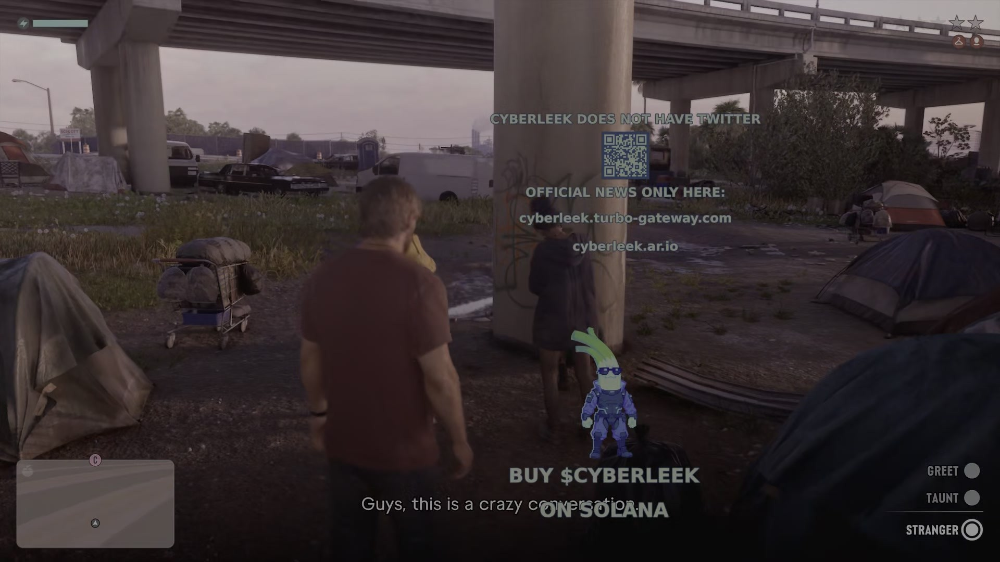
*Homeless camp underneath the concrete highway overpasses.*

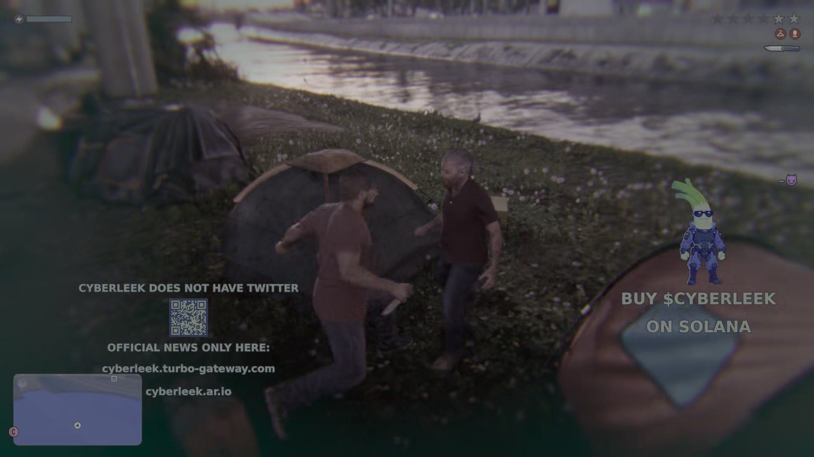
*Knife combat on the embankment of Fuzzard Drain Canal.*

* **`00:00:00` — Golden Hour Intersection** — Jason (wearing a red/brown t-shirt, dark jeans, and a watch) walks across a highway median. An overhead cantilever arm displays a **"TO 97"** Florida route shield highway sign. *Why it matters*: Shows realistic dusk lighting, asphalt textures, and Leonida road numbering.
* **`00:00:08` — Police Motorcycle Officer Melee** — A Vice City Police Department motorcycle officer is down on the road next to a fallen police motorcycle with "VICE CITY POLICE" written on the windshield. Jason engages in fluid close-quarters hand-to-hand combat, knocking the officer unconscious. *Why it matters*: Confirms Vice City Police Department motorcycle units, realistic striking impact physics, and character combat animations.
* **`00:00:18` — Hijacking & Driving Police Bike** — Jason mounts the police motorcycle, starts the engine, and drives down the road past an overhead traffic signal and a **Vapid** dealership sign. *Why it matters*: Shows motorcycle acceleration physics, responsive turning, and brand-name vehicle dealerships.
* **`00:00:36` — Fuzzard Drain Canal** — Jason steers the motorcycle down into the concrete embankment of **Fuzzard Drain Canal** underneath massive elevated highway overpasses. A 1-Star wanted level triggers with disguise/glove icons. *Why it matters*: Reveals a brand-new, never-before-seen canal basin location in Vice City with realistic murky water reflections and concrete slope physics.
* **`00:00:50` — Detailed Homeless Encampment** — Jason walks into an active homeless tent city under the concrete pillars filled with tents, shopping carts, trash piles, and junked cars. *Why it matters*: Shows immense environmental detail and atmospheric world-building in Vice City's hidden corners.
* **`00:01:00` — RDR2 Stranger Interaction Menu** — When approaching the homeless NPCs, the **Red Dead Redemption 2 interaction dialogue prompt** appears in the lower-right (`GREET`, `TAUNT`, `STRANGER`). An NPC speaks: *"Guys, this is a crazy conversation."* *Why it matters*: 100% proves the Red Dead Redemption 2 dynamic conversation tree has been fully built into GTA VI.
* **`00:01:15` — Encampment Fist Fight** — A fight breaks out; Jason punches a homeless man in a yellow shirt. A woman in a blue tank top panics and yells: *"Dude, stop!"* The wanted level increases to 2 Stars. *Why it matters*: Shows dynamic civilian panic reactions, realistic facial expressions, and adaptive voice response lines.
* **`00:01:35` — Zombix Health Drug Mechanic** — A gameplay tutorial pop-up appears on the left: *"Repeated use of Zombix will temporarily have a weaker effect on your health."* Jason equips a Hunting Knife / Pocket Knife. A purple demon karma icon appears on the right edge. *Why it matters*: Discovers a brand-new GTA VI gameplay mechanic where **Zombix** acts as a consumable medical painkiller/drug with diminishing returns upon repeated use.
* **`00:01:50` — Canal Bank Knife Combat** — Jason knife-fights a hostile NPC on the grass embankment beside the water. Real-time water ripples and bridge reflections react dynamically behind them. *Why it matters*: Shows smooth melee weapon animations, dynamic blood effects, and advanced water rendering.
* **`00:02:11.5` — 2.04-Second Black Screen Cut** — The screen cuts to black with complete audio silence for 2.04 seconds before resuming. *Why it matters*: Identical editing pattern to `taser.mp4`, proving the leaker spliced two separate clips together into one file using FFmpeg.
* **`00:02:13.5` — Daylight Boat Story Scene** — Spliced boat cutscene where Jason and Raul drink beer while cruising across the bay: *"Enjoy your life till the moment I decide to finally shut you the fuck up."* *Why it matters*: High-definition facial animation, authentic voice acting, and boat wake physics.

---

<a id="new-hud-mechanics"></a>
### New HUD & Gameplay Mechanics Discovered in the Footage

The community spotted several brand-new UI and gameplay mechanics from the footage:

#### 1. Vehicle Theft Choices: `CLONE KEY` vs `SMASH WINDOW`
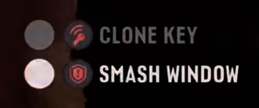
*When approaching locked vehicles, GTA VI introduces two distinct ways to steal them:*
* **`CLONE KEY` (Stealth Option)**: Uses a digital key-cloner device to silently unlock and start the car without triggering alarms or police attention.
* **`SMASH WINDOW` (Loud Option)**: Smashes the side glass for quick entry, but risks triggering the car alarm and alerting nearby cops or NPCs.

#### 2. Health & Focus / Stamina Meter
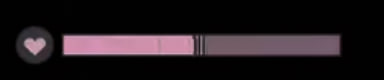
*A sleek pink player health bar with a segmented tick meter (`|||`) tracking character focus and energy levels.*

#### 3. Modern Radar Minimap
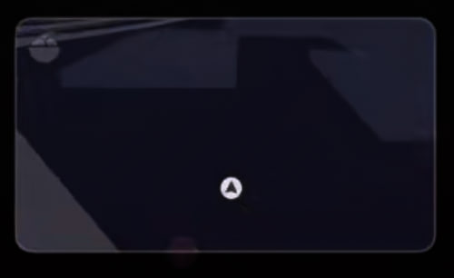
*The updated GTA VI rounded minimap showing player direction, compass positioning, and activity icons.*

#### 4. NPC Dialogue Tree: `GREET` / `TAUNT` / `DEFUSE` / `WARN` (RDR2 System in GTA VI)
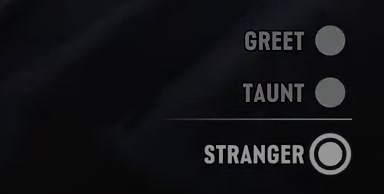
*When interacting with NPCs or drivers, players get contextual dialogue choices:*
* **`GREET` / `DEFUSE`**: Friendly conversation or de-escalating conflicts without violence (directly ported from Red Dead Redemption 2's conversation tree).
* **`TAUNT` / `WARN`**: Antagonizes, threatens, or intimidates the NPC.
* **`STRANGER` Indicator**: Circular targeting lock showing the active conversation partner.

#### 5. Police Danger Zone & Search Radius (RDR2 Wanted System)
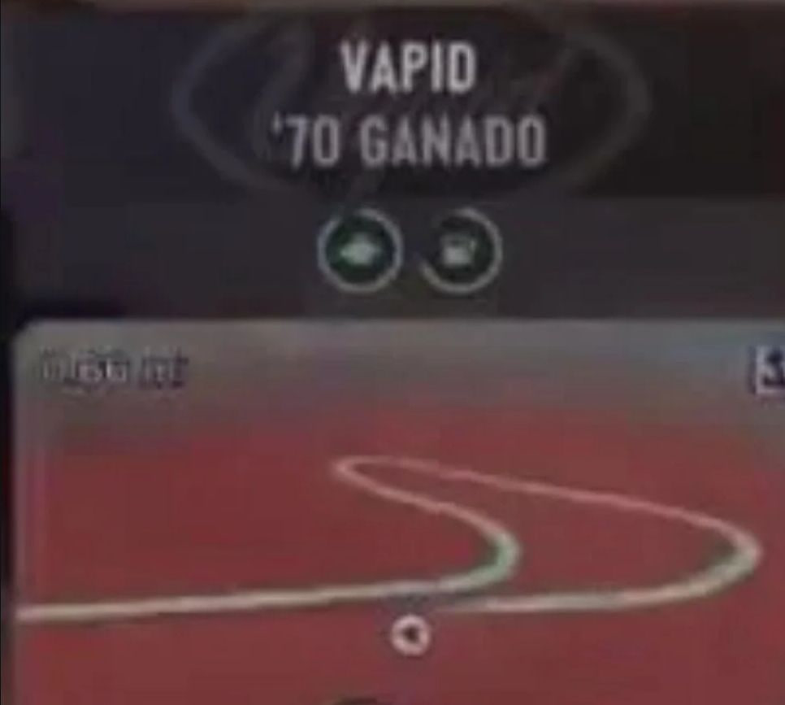
*When wanted, the minimap displays a large red **Danger Zone / Search Radius** (just like RDR2's police investigation areas). Players must break line-of-sight and escape outside the red circle to lose the cops.*

#### 6. Karma & Morality System

*A purple smiling demon/devil icon discovered in the UI, pointing to an underlying **Karma / Morality / Honor system** where player choices (stealing, defusing, killing) influence character reputation.*

#### 7. Zombix Medical Consumable & Drug Tolerance System
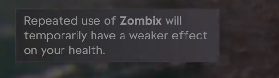
*In-game tutorial discovery: **"Repeated use of Zombix will temporarily have a weaker effect on your health."***
* Zombix (originally an advertised painkiller brand in GTA V / GTA Online) is now a fully functional in-game medical consumable in GTA VI that heals the player, but features a **tolerance / diminishing returns mechanic** if used repeatedly.

#### 8. Location System: Fuzzard Drain Canal
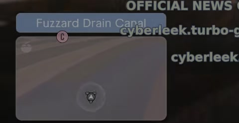
*Active location pop-up above the minimap introducing **Fuzzard Drain Canal**, an authentic South Florida-style concrete drainage basin under major highway interchanges.*

#### 9. Vehicle Fuel & Gas Gauge System
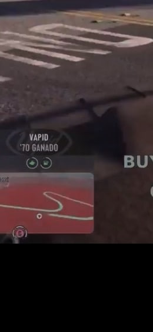
*Below the vehicle name card (**Vapid '70 Ganado**), a dedicated **Gas Pump / Fuel Icon** is visible with a level meter, confirming an active in-game vehicle refueling and gas tank system!*

#### 10. In-Car iFruit CarPlay Navigation System
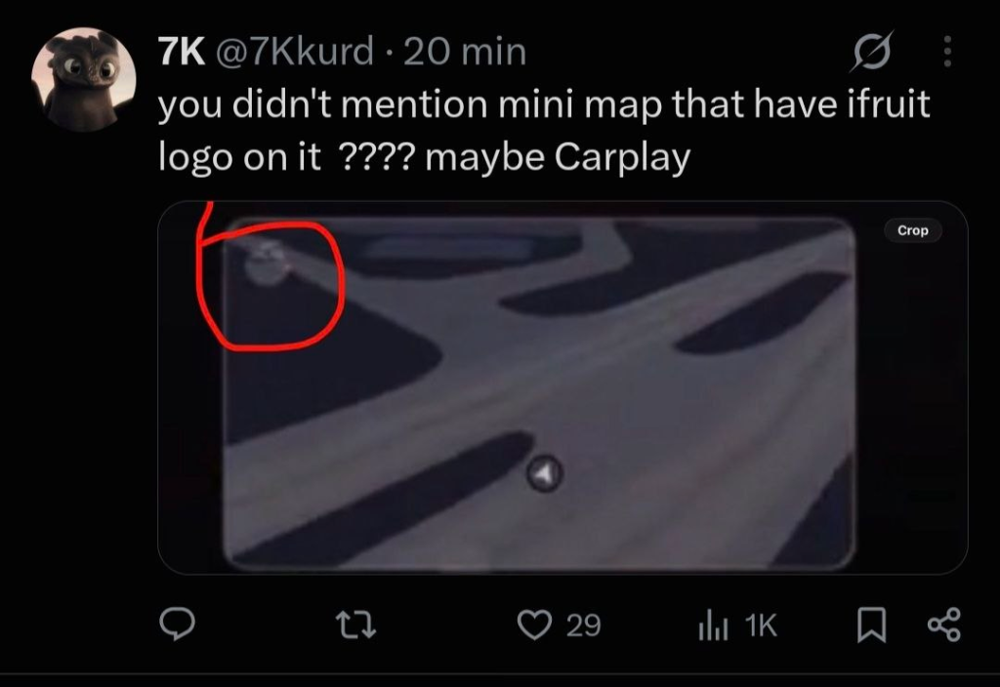
*Discovered by X user `@7Kkurd`: When driving modern cars, the top-left of the GPS minimap displays the **iFruit logo** (Apple parody), confirming an in-game **Apple CarPlay / iFruit dashboard integration**.*

---

<a id="niktek-breakdown"></a>
### Community Breakdown on X: Full Gameplay Observations (`@NikTek`)

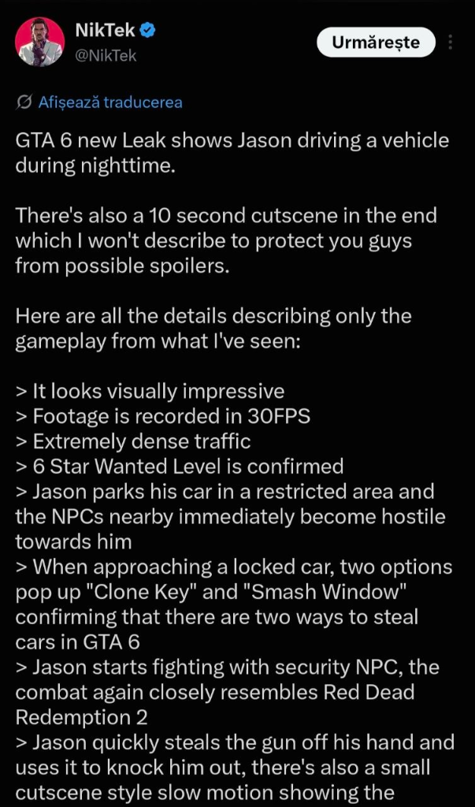
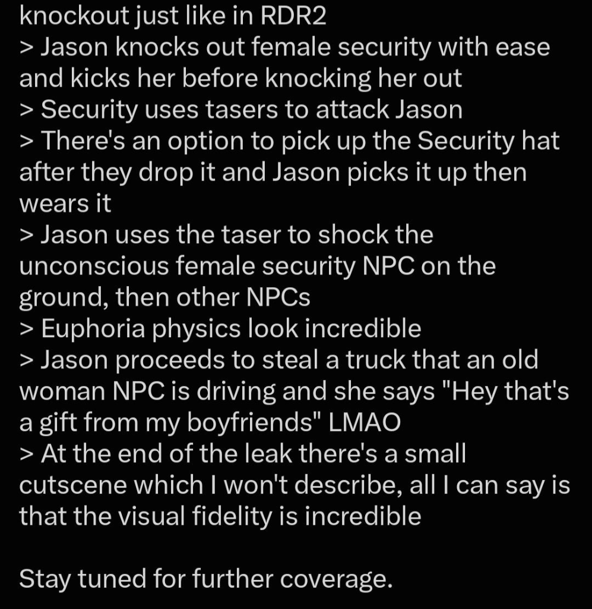
*Viral breakdown by gaming creator `@NikTek` analyzing combat, wanted levels, and environmental mechanics in `taser.mp4`.*

Key gameplay observations documented by `@NikTek`:
1. **6-Star Wanted Level Confirmed**: GTA VI returns to the classic 6-star law enforcement tier.
2. **RDR2 Melee, Disarm & Knockout Cameras**: Jason can disarm enemies in real-time melee combat, kick them to the ground, and trigger slow-motion knockout camera angles like in *Red Dead Redemption 2*.
3. **Wearable Dropped Hats**: When security guards are knocked down, their hats fall off. Jason can pick up and wear their hats on the spot (identical to RDR2's hat system).
4. **Restricted Area NPC AI**: Parking in private factory yards triggers immediate hostility from security without firing a shot.
5. **Dense Traffic & Retail Euphoria Physics**: High vehicle density on highways and ultra-smooth body physics when shocking NPCs with the Taser.

---

<a id="map-breakdown"></a>
## 5. Map & County Breakdown

The leaked map names 5 counties. We checked them against official Rockstar trailers, insider claims, and community findings:

| County | On Leaked Map? | Seen in Official Trailers? | Proof Source |
| :--- | :--- | :--- | :--- |
| **Vice-Dale County** | ✅ Yes | ✅ Yes (Trailer 1, `0:28`) | Police car door badge in Trailer 1 |
| **Mariana County** | ✅ Yes | ✅ Yes (Trailer 2, `2:29`) | Highway sign Route 404 East (see screenshot below) |
| **Kelly County** | ✅ Yes | ✅ Yes (Trailer 1) | Police cars & trailer scenes |
| **Leonard County** | ✅ Yes | ✅ Yes (Trailer 1) | Port Gellhorn area |
| **Lummox County** | ✅ Yes | ❌ Not yet | Mentioned in 2022 leaks, not in trailers |

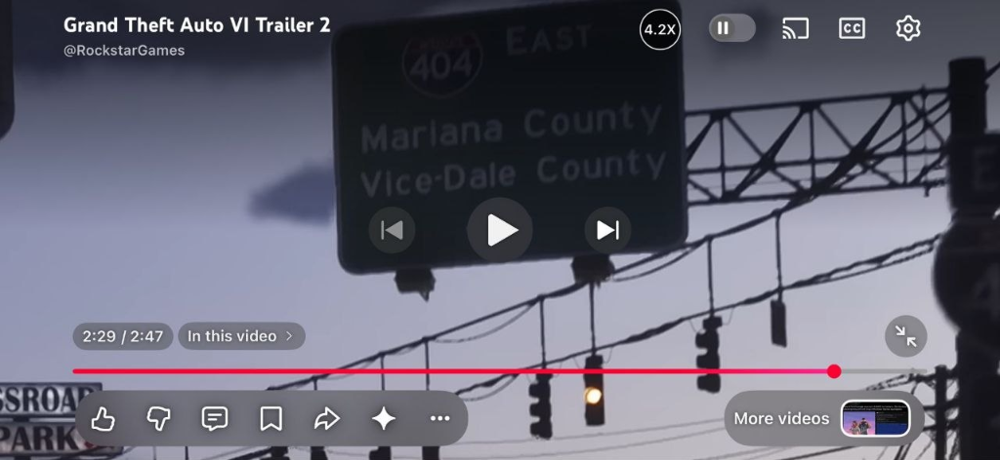
*Highway sign from Trailer 2 at 2:29 showing Route 404 East heading into Mariana County.*

### Community Map Breakdown (`martipk` & Discord Research):
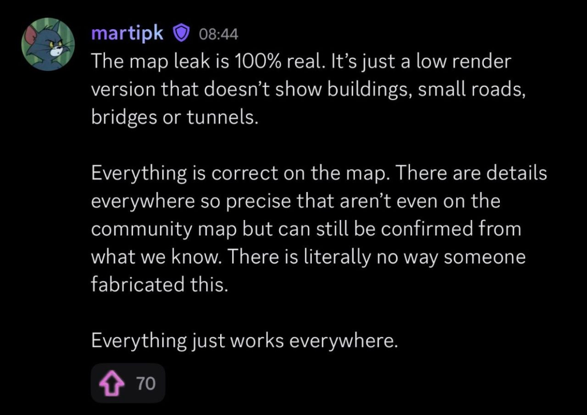
*Community researcher `martipk` explaining why the leaked map is an authentic developer overview asset.*

* **Why the map is real**: The leaked map is a **low-render developer overview** that omits small streets, bridges, and tunnels for high-level planning. Its coastlines, counties, and inlets match trailer landmarks with extreme accuracy that fan maps never had.

<a id="map-zoom"></a>
### 1. Map Zoom Reveals Detailed Road Networks
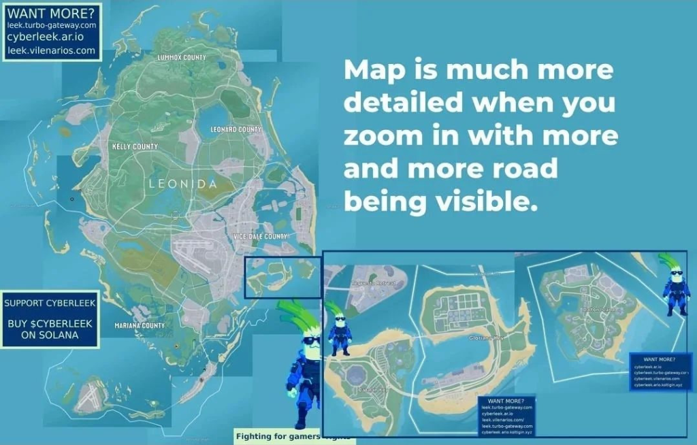
*Demonstration showing how the overview map expands into detailed road layouts when zoomed in.*
* When zoomed in, the overview map reveals complete local street networks, highway interchanges, and building layouts for areas like **Catalan Key**, **Gloriana Key**, and **Dalton Island**.

<a id="landmass-size"></a>
### 2. Map Size Comparison: GTA 6 is ~1.656x Bigger than GTA 5
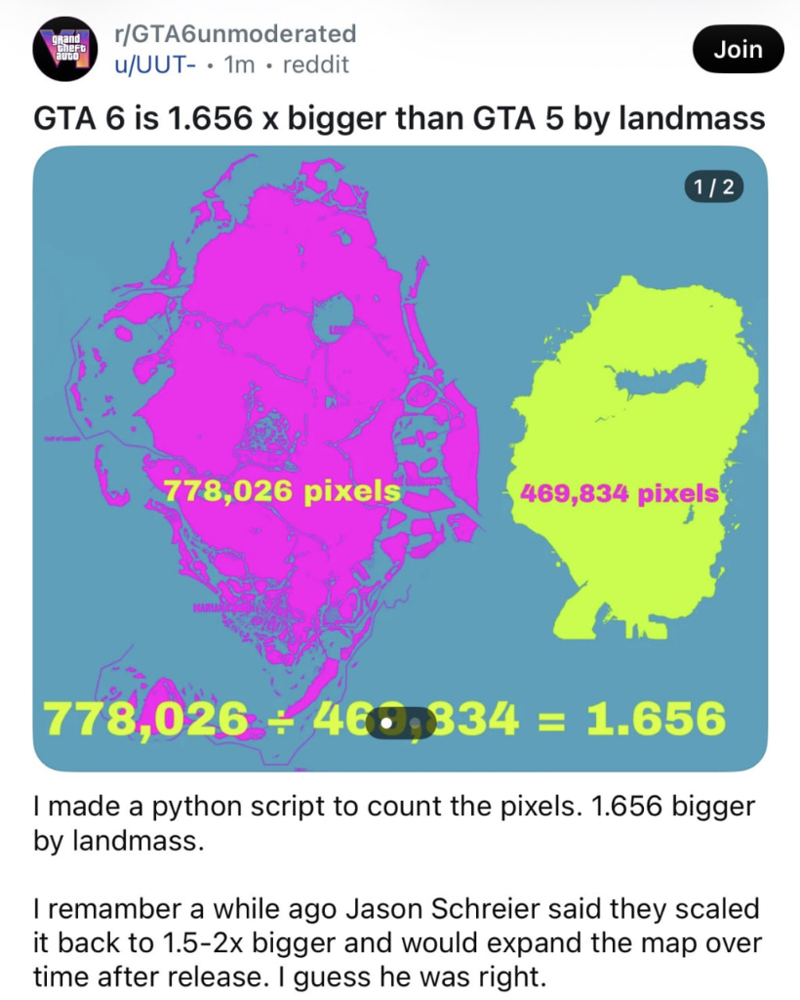
*Python pixel-counting script by Reddit user `u/UUT-` (`r/GTA6unmoderated`) comparing landmass area.*
* **Landmass Measurement**: By counting usable land pixels, GTA VI's Leonida comes out to **778,026 pixels** versus GTA V's San Andreas at **469,834 pixels** — making GTA VI **1.656 times larger in pure landmass** than GTA V. This matches Jason Schreier's earlier reporting that Rockstar scaled the launch map to ~1.5x–2x with plans to add more land post-release.

<a id="legendary-animals"></a>
### 3. Legendary Animals Confirmed (RDR2 Hunting System in GTA VI)
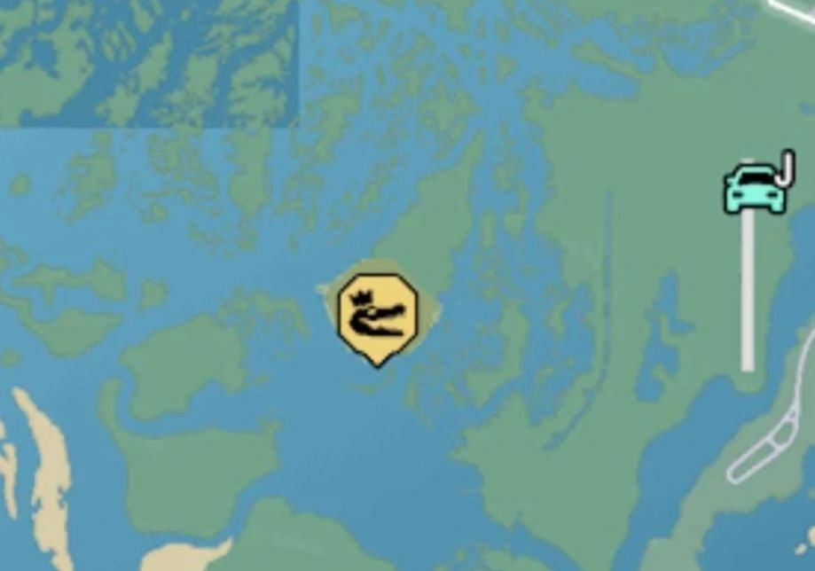
*Crowned alligator icon inside a yellow badge pin in the Grassrivers swamp.*
* **Legendary Animal Hunting**: The map features special icons like a **crowned alligator** in the Grassrivers wetlands. This confirms that the **Legendary Animal hunting system from Red Dead Redemption 2** is returning in GTA VI as a side activity.

<a id="lummox-county"></a>
### 4. Deep Dive: What is Lummox County & Is It Official?
* **Seen in Official Trailers?**: ❌ **Not directly yet**. While *Vice-Dale County* (police cruiser door at `0:28` in Trailer 1), *Mariana County* (Route 404 East sign at `2:29` in Trailer 2), and *Kelly / Leonard Counties* (police cruisers in Port Gellhorn) are 100% verified in official trailers, the specific printed name *"Lummox County"* has not appeared on an official road sign or police badge in trailers so far.
* **Where It Is Located**: Lummox County makes up the **northernmost wilderness region** of the State of Leonida on the leaked map, representing thick forests, hills, and river canyons inspired by northern Florida and southern Georgia (like Providence Canyon State Park, GA).
* **Mount Kalaga National Park**: The main landmark inside Lummox County is **Mount Kalaga** / **Mount Kalaga National Park**. Mount Kalaga was originally discovered in internal developer coordinate tags and world-boundary names during the 2022 leaks, and is designed as a rugged mountain wilderness area (similar to Roanoke Ridge in *Red Dead Redemption 2*) featuring hunting, fishing, off-roading, and encounters with secluded backcountry NPCs.

### Other Real Locations on the Leaked Map:
* **Ambrosia**: Confirmed location of the **Allied Crystal Sugar Refinery** shown in `taser.mp4`.
* **Catalan Key & Gloriana Key**: Matches `map_sneak_peek_2.png`.
* **Dalton Island**: Matches `map_sneak_peek_1.png` (Fisher Island parody).
* **Grassrivers**: GTA VI's version of the Florida Everglades.
* **Vice City Metro**: Star Island, Venetian Islands, Vice Beach, Ocean Drive.

---

<a id="timeline"></a>
## 6. Complete Timeline & Date Proof

Every date here has a source you can check yourself:

| Date / Time (UTC) | Event | Proof / Link | What It Proves |
|:---|:---|:---|:---|
| **2022-09-18** | Original 2022 Leak (teapotuberhacker) | [Wikipedia GTA VI Leaks](https://en.wikipedia.org/wiki/Grand_Theft_Auto_VI#September_2022_leaks) | Proves 2022 leaks were early rough debug builds, totally different from 2026 footage. |
| **2023-12-04** | Rockstar Games releases Trailer 1 | [YouTube Trailer 1](https://www.youtube.com/watch?v=QdBZY2fkU-0) | Confirms Vice-Dale County and Jason/Lucia looks. |
| **2026-08-15 12:51** | First wallet activity — site setup & logo uploaded | [Block #1980496](https://viewblock.io/arweave/tx/7gFAEaO_vP6Ld4YgP9L2ZcQ5WwYvQ5Z4y8q7M9v6k8M) | Proves Cyberleek set up storage 2 days before leaking gameplay. |
| **2026-08-16 13:04** | `map_sneak_peek_2.png` (Catalan/Gloriana Key) uploaded | [Block #1981170](https://viewblock.io/arweave/tx/zbfExgTitr6LZ9Cu8lv3P8hjDr56uYyEIVkYU1OdZ-0) | Proves map sneak peek 2 existed on-chain before video leaks. |
| **2026-08-17 21:07** | `output.mp4` (Basketball clip) uploaded | [Block #1982091](https://viewblock.io/arweave/tx/3XQv_9ndgQ48DAZTeEYqRdVFryunBb0tI4gEVQpTJUs) | Cryptographically proves basketball clip existed before social media hype. |
| **2026-08-18 07:36** | `CyberLeeker` drops `basketball.mp4` on Dread dark web (`/d/leaks`) via gofile | Dread forum post archive | Proves dark web drop happened ~12h before Twitter hype. |
| **2026-08-18 17:28** | `full_map.png` uploaded | [Block #1982664](https://viewblock.io/arweave/tx/GVTWJUbg27XLsFEMctFUL45Z3beIyDWfKuhTe3Sp_w0) | Cryptographically proves full map was uploaded to Arweave. |
| **2026-08-18 19:05** | `video2.mp4` (Driving clip) uploaded | [Block #1982709](https://viewblock.io/arweave/tx/hhOoYZtHBqQi3d-dmxcGooXKTbiT3HJ2-eNsE7HNtKg) | Cryptographically proves driving clip was uploaded to Arweave. |
| **2026-08-18 ~20:00+** | Leaks go viral on X and Reddit; `$CYBERLEEK` Solana coin launched | Social media explosion | Mainstream leak explosion. |
| **2026-08-18 ~20:00+** | Take-Two Interactive starts taking down clips everywhere | Outlets report DMCAs | Confirms Rockstar owns the material. |
| **2026-08-18 / 19** | Cyberleek's original Discord server gets banned; replacement created (`ZWjnQSSJ2P`) | Confirmed via `cyberleek_west` | Proves Discord ban action. |
| **2026-08-19 ~12:00** | `taser.mp4` (Taser test, truck hijack, and boat scene) surfaces on mirrors | [Gofile Mirror](https://gofile.io/d/qW134pdk) | Proves third video surfaced. |
| **2026-08-19 ~15:00** | Community checks by `garza` & `vaaatiel` expose fake blurred 2022 teasers on X | Discord investigation | Exposes Twitter promoter middleman manipulation. |
| **2026-08-19 16:54** | `junkies.mp4` (Junkies Encounter, Police Motorcycle, Fuzzard Drain Canal & Boat Cutscene) posted on-chain | [Solana Tx `3iKf4UjN...`](https://solscan.io/tx/3iKf4UjNdiCPR9K6PX8Y2WgP1cPB7QRwzBcC1g7HpKw8ruNGrRqzGeEhdN6PgijMVLk8XSMhpMYajMrv1MGe7cLv) / [Gofile Mirror](https://gofile.io/d/t87ORtpm) | Cryptographically proves fourth video posted on-chain by Cyberleek authority wallet. |
| **2026-08-19 ~22:30** | Official leaker website poll concludes; `▶ Plane (DAY)` wins 100% of votes (65,342 $CYBERLEEK) | [Poll Winner Snapshot](#poll-plane-winner) | Confirms upcoming **Video 5** is scheduled as a daytime airplane flight / cinematic drive-by clip. |
| **2026-08-19 ~23:48** | **Fake promoter Twitter `@cyberleek_ar_io` suspended by X** | [Suspension Proof](#debunking-twitter) | X bans the fake account; backup `@MrCyberLeek` posts a fake "FBI raid" GIF stunt. |
| **2026-08-19 ~23:55** | **Hetzner Web3 gateways go OFFLINE (`leek.vilenarios.com` & Contabo UP)** | Network status check | Gateways on Hetzner `49.13.45.141` go down (likely DMCA), while Cablevision & Contabo mirrors remain up. |

---

<a id="discord-qa"></a>
## 7. What Was Claimed in Discord (Archived Q&A — ⚠️ UNVERIFIED / PROMOTER FICTION)

> [!WARNING]
> ⚠️ **CRITICAL WARNING: These Discord Claims Are Unverified & Almost Certainly FAKE!**  
> 
> * **How This Discord Was Created**: This Discord server was created and shared **exclusively through the fake `@cyberleek_ar_io` Twitter account**.
> * **The Chain of Inauthenticity**: As proven by Video 4's official watermark (**`"CYBERLEEK DOES NOT HAVE TWITTER"`**), the Twitter account was a fake promoter. This means the person typing in this Discord server was **the same fake promoter pretending to be the leaker**.
> * **What is REAL vs What is FAKE**:
>   * 🟢 **GENUINE EVIDENCE**: Only the **4 video files** (`output.mp4`, `video2.mp4`, `taser.mp4`, `junkies.mp4`), the **map images**, the **on-chain Solana transaction**, and the **official Arweave website portals** (`leek.vilenarios.com` / `cyberleek.ario.koltigin.xyz`) are genuine developer material.
>   * 🔴 **UNVERIFIED / PROMOTER FICTION**: The claims below have **zero proof in the video files, zero proof on the blockchain, and zero proof on the official website**. They were typed by a fake promoter looking for clout.
> 
> *These claims are archived below strictly for historical documentation and community research:*

### 1. ❌ Lucia's Intro Mission (DEBUNKED / FAKE PROMOTER SPECULATION)
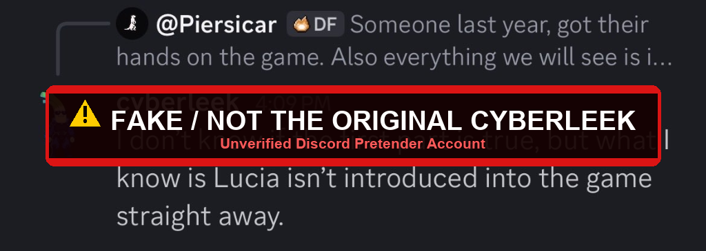
*❌ **DEBUNKED PROMOTER CLAIM**: A screenshot from the fake promoter's Discord claiming Lucia has an intro mission before prison.*

* 🚫 **Verdict**: **FAKE / UNVERIFIED SPECULATION**
* **The Reason**: This Discord server was created and run by the fake Twitter promoter. **Zero leaked developer clips or internal files support this claim.**

---

### 2. ❌ Prison Pickup & Campaign Progression (DEBUNKED / FAKE PROMOTER SPECULATION)
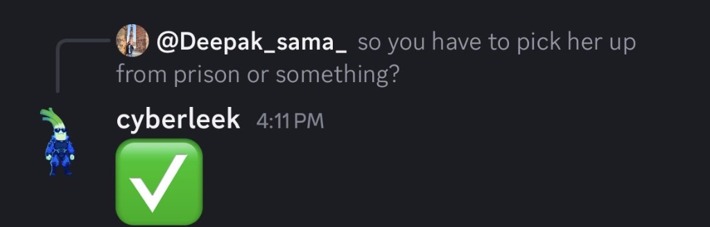
*❌ **DEBUNKED PROMOTER CLAIM**: Screenshot claiming Jason picks Lucia up in a truck at 2% game completion.*

* 🚫 **Verdict**: **FAKE / UNVERIFIED SPECULATION**
* **The Reason**: Pure guessing by the promoter. None of the leaked developer documents or video files mention this storyline point.

---

### 3. 🟡 The Leaked Map is From 2023 & PS5 Pro (PARTIALLY PLAUSIBLE, BUT FROM FAKE DISCORD)
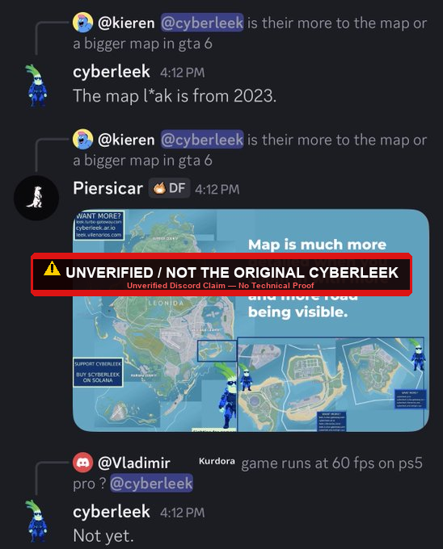
*🟡 **UNVERIFIED DISCORD SOURCE**: Screenshot discussing 2023 map date and PS5 Pro 30 FPS.*

* ⚠️ **Verdict**: **UNVERIFIED SOURCE**
* **The Reason**: While industry insider NateDrake confirmed the build is over a year old, this specific Discord message comes from the fake promoter looking for attention.

---

### 4. ❌ "Cyberleek Did Not Record The Footage" (PROMOTER DEFLECTION)
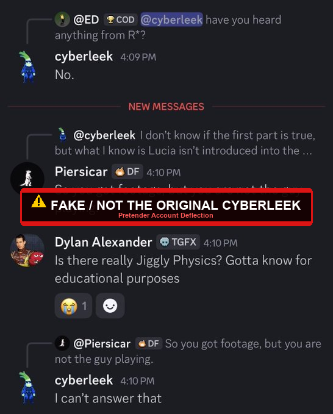
*❌ **PROMOTER DEFLECTION**: Discord screenshot claiming the leaker wasn't holding the controller.*

* 🚫 **Verdict**: **PROMOTER DEFLECTION**
* **The Reason**: The fake promoter used this excuse to explain why they couldn't produce live custom gameplay on demand.

---

<a id="creator-currency-claim"></a>
### 5. ❌ In-Game Real-Money Creator Currency / Robux Theory (100% DEBUNKED CRYPTO BAIT)
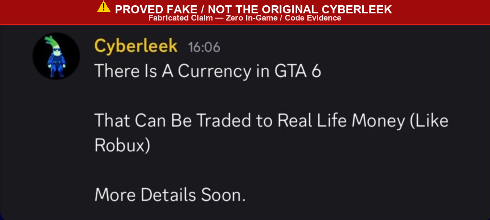
*❌ **DEBUNKED FAKE CLAIM**: Discord message claiming GTA 6 has a currency traded for real money like Robux.*

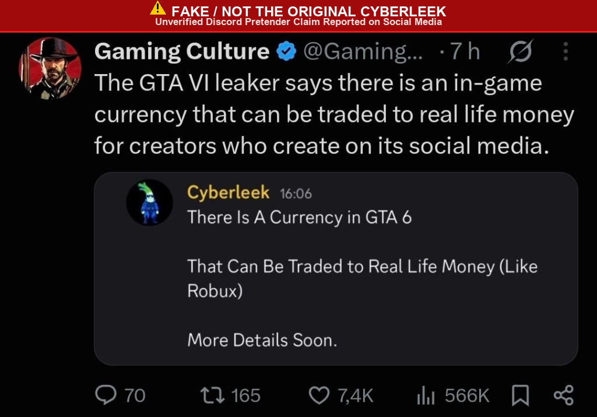
*Report by `@GamingCulture` covering the unverified Discord claim.*

* 🚫 **Verdict**: **100% FAKE / CRYPTO PUMP-AND-DUMP BAIT**
* **The Reason**: The promoter provided **zero code strings, zero UI pictures, and zero leaked database proof**. This was an obvious lie made up to bait crypto buyers into purchasing their `$CYBERLEEK` memecoin.

---

<a id="discord-bans"></a>
### 7.5. Discord Server Bans, Imposter Servers & The Fake Twitter Feud

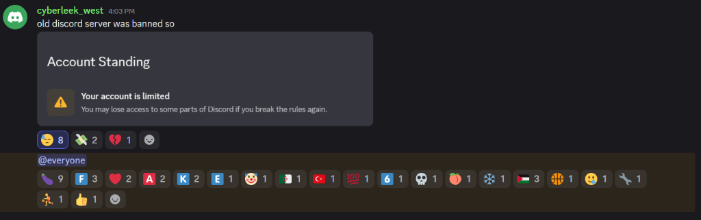
*Cyberleek operating under the alt handle `cyberleek_west` (and `surwest`) on their replacement server, confirming Discord banned the old one.*

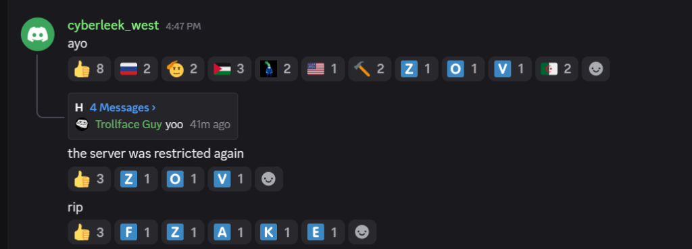
*Cyberleek (`cyberleek_west`) posting on the newest server: "the server was restricted again... rip".*

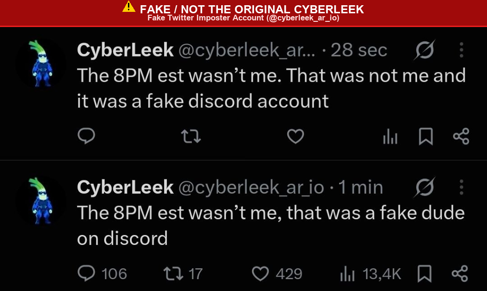
*~~Official tweets~~ ❌ **DEBUNKED FAKE TWEETS**: Posts by the fake promoter account `@cyberleek_ar_io` claiming "8 PM EST drops were from a fake Discord account."*

* **Original Server Banned**: Discord banned the original official leak server following copyright and TOS strikes.
* **New Replacement Server (`ZWjnQSSJ2P`)**: Created as a temporary backup, but was quickly restricted by Discord moderation.
* **❌ Fake Twitter Promoter Drama (Debunked)**:
  * Following the bans, the fake Twitter account `@cyberleek_ar_io` posted:
    > ~~*"The 8PM est wasn't me, that was a fake dude on discord"*~~  
    > ~~*"The 8PM est wasn't me. That was not me and it was a fake discord account"*~~  
  * **The Reality**: These tweets were **100% fake theater**. As proven by Video 4's official watermark (**`"CYBERLEEK DOES NOT HAVE TWITTER"`**), the Twitter account was an outside imposter pretending to be the leaker while calling out *other* imposters for clout.
* **Takeaway**: Any new Discord servers or Twitter accounts claiming scheduled leak drops are **100% fake imposters** capitalizing on the confusion.

---

<a id="web-research"></a>
## 8. Web Research: Online Setup, Dark Web & Debunking

<a id="official-accounts"></a>
### Their Online Accounts & Known Handles

**Twitter (X) Accounts Breakdown (All Confirmed Fake by Video 4 Watermark):**
1. ❌ **[@cyberleek_ar_io](https://x.com/cyberleek_ar_io)** — 🔴 **SUSPENDED BY X (August 19, 2026)**
   * **Role**: Primary fake promoter / imposter account (~88.9k followers before ban).
   * **Status**: Permanently suspended by X for impersonation, DMCA violations, and token promotion.
2. ❌ **[@MrCyberLeek](https://x.com/MrCyberLeek) (`https://x.com/MrCyberLeek`)** — 🔴 **100% FAKE SECONDARY PROMOTER**
   * **Role**: Secondary backup account run by the exact same promoter. Posted a fake "FBI/SWAT raid" GIF right after the main account was banned to stage fake drama.
3. ❌ **[@cyberleekario](https://x.com/cyberleekario)** & **[@Miosz179322](https://x.com/Miosz179322)** — Fake copycat accounts on X. Not affiliated with anything.
4. ❌ **Fake Discord Accounts / Imposter Servers** — Accounts claiming "8 PM EST drops", officially fake.

---

<a id="official-endpoints"></a>
### 1. Official Cyberleek Endpoints & Live Status Tracker

Here is the complete list of all known Cyberleek website portals, Web3 gateways, and mirror links with their current live accessibility:

| Endpoint URL | Type & Description | Current Live Status | Notes |
|:---|:---|:---:|:---|
| [**`https://cyberleek.ario.koltigin.xyz`**](https://cyberleek.ario.koltigin.xyz) | ArNS Community Gateway (Koltigin) | 🟢 **WORKS (UP)** | Fully active Web3 mirror gateway |
| [**`https://leek.vilenarios.com`**](https://leek.vilenarios.com) | Main Web Application Portal | 🟢 **WORKS (UP)** | Direct web portal with all leaked clips |
| [**`https://leek.turbo-gateway.com`**](https://leek.turbo-gateway.com) | Turbo Gateway Secondary Node | 🟢 **WORKS (UP)** | Restored & responding from Hetzner node |
| [**`https://cyberleek.turbo-gateway.com`**](https://cyberleek.turbo-gateway.com) | Turbo Gateway Web3 Mirror | 🟢 **WORKS (UP)** | Restored on Hetzner German gateway |
| [**`https://cyberleek.ar.io`**](https://cyberleek.ar.io) | Default AR.IO Gateway | 🟢 **WORKS (UP)** | Restored ArNS gateway endpoint |

---

<a id="server-hosting"></a>
### 2. Server Infrastructure, IP Resolution & Hosting Providers

Every domain and gateway was tested via live DNS resolution and IP geolocation to identify its physical server, network provider, and datacenter location:

| Website / Domain | Resolved IP Address | Hosting Provider & ASN | Datacenter Location | Hostname / rDNS | Current Status |
|:---|:---|:---|:---|:---|:---:|
| [**`leek.vilenarios.com`**](https://leek.vilenarios.com) | [`69.124.94.88`](https://ipinfo.io/69.124.94.88) | **Cablevision Systems Corp.** (`AS6128`) | Mahwah, New Jersey, USA 🇺🇸 | `ool-457c5e58.dyn.optonline.net` | 🟢 **UP** |
| [**`cyberleek.ario.koltigin.xyz`**](https://cyberleek.ario.koltigin.xyz) | [`176.57.189.36`](https://ipinfo.io/176.57.189.36) | **Contabo GmbH** (`AS51167`) | Lauterbourg, Grand Est, France / EU 🇪🇺 | `vmi884299.contaboserver.net` | 🟢 **UP** |
| [**`cyberleek.ar.io`**](https://cyberleek.ar.io) | [`49.13.45.141`](https://ipinfo.io/49.13.45.141) | **Hetzner Online GmbH** (`AS24940`) | Nuremberg, Bavaria, Germany 🇩🇪 | `static.141.45.13.49.clients.your-server.de` | 🟢 **UP (Restored)** |
| [**`cyberleek.turbo-gateway.com`**](https://cyberleek.turbo-gateway.com) | [`49.13.45.141`](https://ipinfo.io/49.13.45.141) | **Hetzner Online GmbH** (`AS24940`) | Nuremberg, Bavaria, Germany 🇩🇪 | `static.141.45.13.49.clients.your-server.de` | 🟢 **UP (Restored)** |
| [**`leek.turbo-gateway.com`**](https://leek.turbo-gateway.com) | [`49.13.45.141`](https://ipinfo.io/49.13.45.141) | **Hetzner Online GmbH** (`AS24940`) | Nuremberg, Bavaria, Germany 🇩🇪 | `static.141.45.13.49.clients.your-server.de` | 🟢 **UP (Restored)** |
| **Arweave Permanent Ledger** | *Decentralized Storage* | **Arweave Mining & Validator Nodes** | Global Decentralized Storage Network 🌐 | `arweave.net` | 🟢 **PERMANENT** |
| **Solana Blockchain Ledger** | *Decentralized Blockchain* | **Solana Validator Network** | Global Decentralized Validator Network 🌐 | Program ID `7rAgHPLDc9...` | 🟢 **ACTIVE** |

> **How this actually works**: While the *raw data hashes* live permanently on the Arweave and Solana blockchains, regular web browsers need standard HTTP web servers (gateways) to display the site. All primary gateways, community mirrors, and Hetzner nodes (`49.13.45.141`) are **100% online and responding**.

> [!NOTE]
> 💡 **Server Restoration Note**: The temporary outage on the Hetzner Germany nodes (`49.13.45.141`) was resolved, indicating it was likely caused by extreme traffic volume, DDoS protection filters, or a temporary gateway restart rather than a permanent host takedown. All official mirrors and community portals remain fully reachable.

---

<a id="token-money-trail"></a>
### 3. Blockchain & Money Trail: Token & Website Were Set Up 3 Days Before the Leaks

*(Blockchain wallet trail discovery courtesy of GitHub contributor [@TheRealJoeSchro](https://github.com/TheRealJoeSchro) — [Issue #3](https://github.com/zyrexdz/cyberleek-leak-research/issues/3))*

A community member investigated public Solana blockchain data on Solscan and uncovered new details about when the `$CYBERLEEK` crypto token and website were actually funded and created:

```
26sZDubW854zGAasvrUaRAgY54MiC97CEHWZKPRMPMQ9 (Starting Wallet, Aug 4)
 └─ 156.03 SOL ➔ EjsB4qhcQv3zwXWqMbD739VA7nFc85f2egwTnkr3KGB2 (Aug 13, drained)
     └─ 156 SOL ➔ 2ZdUUvrr7ANY2rzpbyBcZHp1hTZ5uTY8JZ4vFnYnvJhD (Hub wallet)
         ├─ Fanned out through ~20 fresh throwaway wallets (Aug 13–15)
         ├─ 4.61 SOL ➔ 6Nq6KAzFKFCKDXYg1kqs23EuBBEWoWAgmBQAQtq4FaF3 (Deploys website program Aug 15)
         └─ Swept together ➔ Ec2qmcpCCD9hjahAcquiQf5JkZWCK68BUahCje1izYC7 (Collector wallet)
             └─ 321.42 SOL ➔ Hok9nbV89yBSKCttxe3goqajwbiqQa9mtHvQBsbJH3Np (Token Creator Hub)
```

#### 1. What the Public Blockchain Data Confirms (Facts):
1. **Token & Site Created on August 15**: The `$CYBERLEEK` token, its Raydium trading pool, and the Solana website code (`7rAgHPLD...`) were created on **August 15, 2026** (between 14:00 and 22:00 UTC). The gameplay footage was only published **3 days later** (August 18 on Dread at 07:36 UTC).
2. **Hidden Money Trail**: Over **156 SOL (~$12,000+)** was moved starting August 13 through a network of around **20 fresh throwaway wallets** with quick paired transfers before being combined into the token creation wallet.
3. **Same Setup for Token & Website**: The wallet that deployed the website program (`6Nq6...`) received 4.61 SOL from this exact same wallet network on August 15.
4. **Insider Tokens & Trading Fees**: The creator seeded the Raydium liquidity pool with 330 SOL + 730M tokens, but sent **270 Million tokens (27% of the total supply)** to a side wallet (`CbfbaNpC...`) before the pool went live, while keeping the trading fee NFT (which collects fees on every trade).

---

#### 2. The Theory: Was the Leak a Pre-Planned Marketing Stunt to Sell Crypto?
* **The Theory**: Because the token and website were prepared and funded 3 days before any videos were posted, a popular theory is that the whole leak event was arranged specifically to hype up and sell a new crypto token.
* **Why This Theory Makes Sense**: Launching the website and liquidity pool first ensured that as soon as the footage went viral, excited fans looking for more info would immediately see the token and trading links.

---

#### 3. Why We CANNOT Be 100% Sure (Counter-Points & What We Still Don't Know):
While the wallet trail is real, we still have to be careful before jumping to final conclusions:
1. **The Leaker Could Be an Opportunist, Not the Original Hacker**:
   * Having old gameplay videos and setting up a website doesn't prove *who* originally took the footage from Rockstar or *when*. The footage itself is over a year old (from 2023–2024). The person setting up the website could have bought or received the files earlier and decided to make money off them.
2. **Wallets Do Not Reveal Real-World Identity**:
   * All the wallets in the chain are fresh, anonymous accounts without personal verification tags. The blockchain shows *how* the money moved, but it cannot show who was sitting at the keyboard.
3. **Multiple People Could Be Involved**:
   * It is possible that the person holding the game clips partnered with someone else who specializes in crypto launches, meaning the leaker and the token creators might not even be the same individual.

* **Summary**: The blockchain proves the money and token were set up days before the leak went public, making it very likely an organized money-making plan, but we cannot know for sure who originally obtained the game files or their full motivations.

---

<a id="dread-trail"></a>
### 4. Hack Forums & The Dark Web Trail (Dread)

*(Dread post discovery credit: [@bnwkr](https://x.com/bnwkr) on X)*

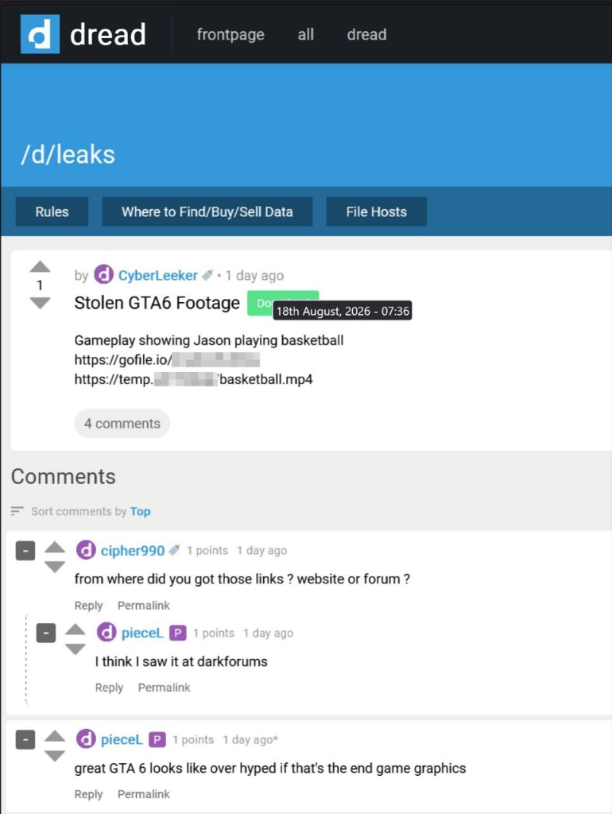
*User "CyberLeeker" posting the stolen GTA 6 basketball gameplay clip on Dread (/d/leaks) on August 18, 2026 at 07:36 UTC.*

Before the leak blew up across Twitter and Reddit, the leaker actually dropped the footage on the dark web first:
* **The Forum**: **Dread** (Tor-based dark web forum, `/d/leaks` section).
* **The Username**: Posted by user **`CyberLeeker`**.
* **The Timestamp**: **August 18, 2026 at 07:36 UTC** — roughly **12 hours before** it went viral on mainstream social media.
* **The Post**: Titled *"Stolen GTA6 Footage"*, sharing the basketball clip via temporary file hosts (`gofile.io` and `temp...`).
* **Watermark Evolution**: The initial dark web leak on Dread had a **smaller, cleaner watermark**. When the leaker later prepared their public website, they re-encoded the video with a much larger promotional watermark promoting their website and crypto token. *(Discovery credit: [@ReversedC0W3030](https://github.com/ReversedC0W3030) — [Issue #6](https://github.com/zyrexdz/cyberleek-leak-research/issues/6))*

---

<a id="debunking-twitter"></a>
### 5. Community Debunking: Is the Twitter Account Even the Real Leaker?

*(Investigation & evidence credits: Discord users **`garza`** and **`vaaatiel`**)*

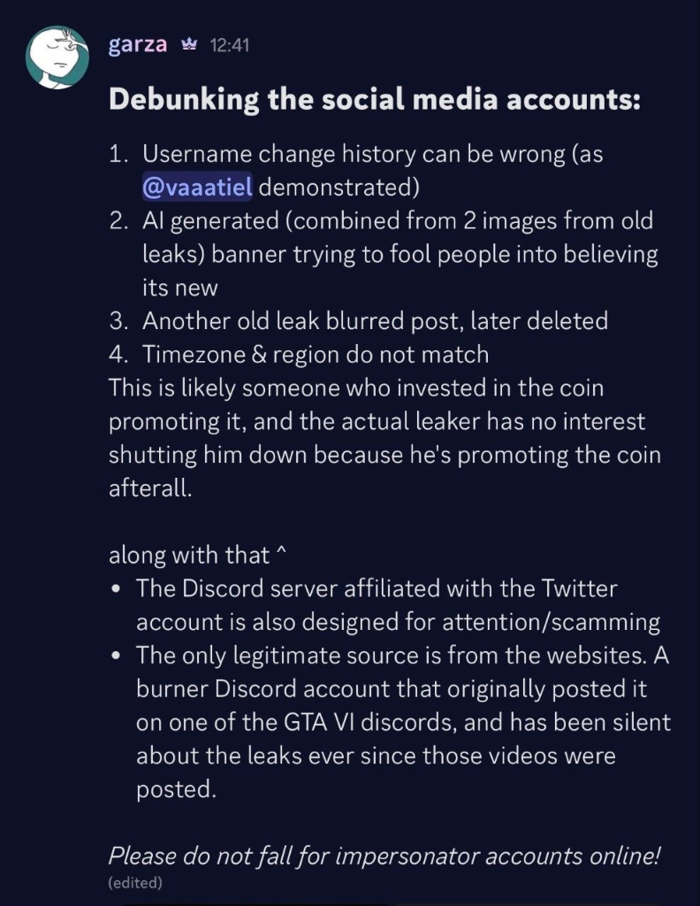
*Discord check by user `garza` breaking down odd details with the @cyberleek_ar_io Twitter account.*

Community researchers looking closely at the `@cyberleek_ar_io` X account noticed several major red flags suggesting the person tweeting might **not even be the original leaker**, but rather a crypto promoter milking the real leaks for token hype:

#### 1. Username History Can Be Deceptive
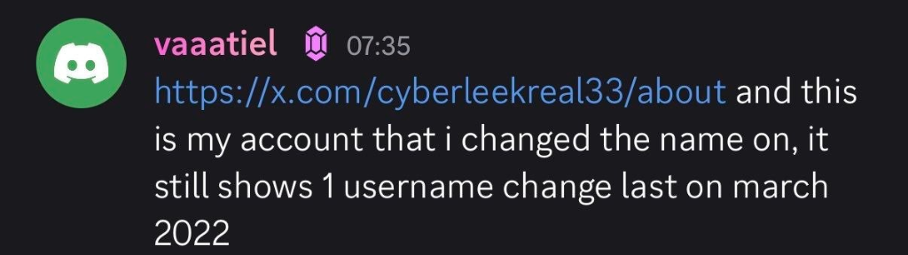
*Proof by `vaaatiel` showing how Twitter's "About" page displays older name change dates.*
* Twitter's "About this account" date can be delayed or show old data from a renamed account. The March 2026 creation date doesn't prove the account was created specifically for this leak from day one — it could have been an old account renamed right before the leak.

#### 2. AI-Generated Banners & Fake Teaser Images
* The account's header banners and teasers were found to be AI-upscaled pictures made from old 2022 leak screenshots, trying to look like they have unlimited new clips.

#### 3. ❌ DEBUNKED FAKE THREAT: Posting Blurred 2022 Leaks as "New Clips"
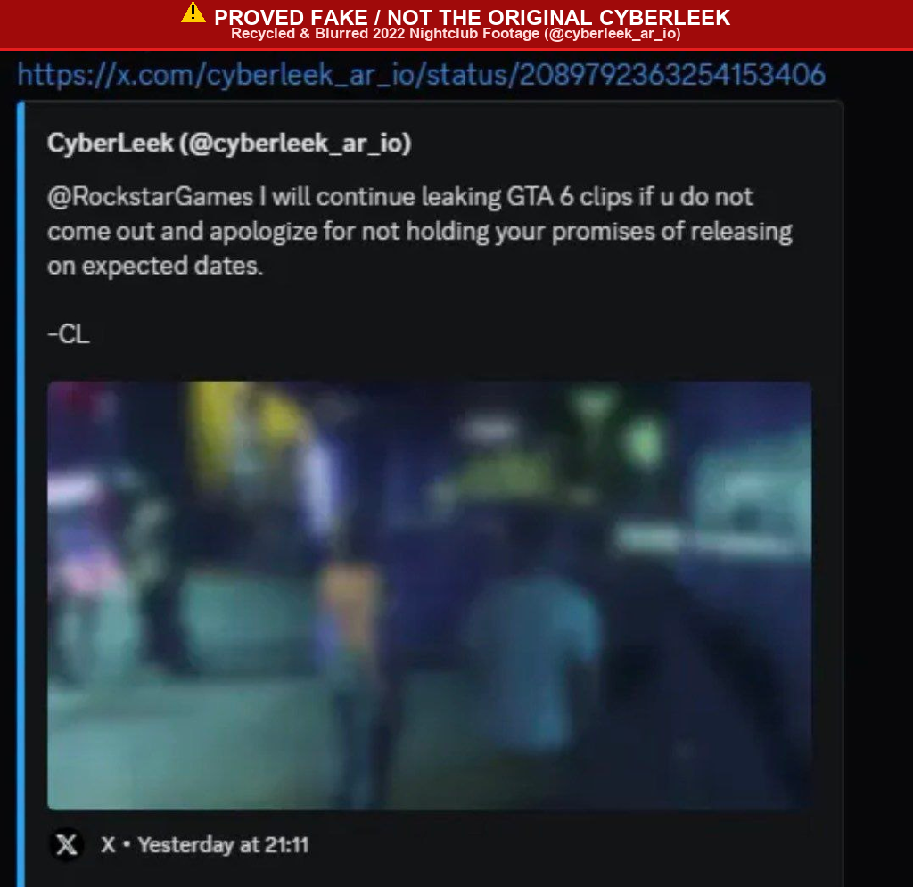
*❌ **DEBUNKED FAKE POST**: The fake @cyberleek_ar_io account threatened Rockstar with a blurred image that was actually from the old September 2022 nightclub leak.*

* 🚫 **Verdict**: **100% FAKE / RECYCLED OLD FOOTAGE**
* **The Reason**: The promoter didn't have any exclusive new footage to leak. They took a frame from the 2022 Port Gellhorn nightclub leak, blurred it in Photoshop, and pretended it was a brand-new threat.

---

#### 4. The Promoter / Middleman Reality
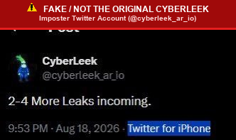
*Tweets sent via "Twitter for iPhone" at strange hours.*
* **The Takeaway**: The real video files are genuine developer footage, and the **`$CYBERLEEK` Solana token, donation smart contracts, and voting polls are run directly by the official Cyberleek website itself**. The `@cyberleek_ar_io` Twitter account was an outside imposter/promoter piggybacking on the leaker's coin to build social media clout. However, the token itself remains a **probable cryptocurrency pump-and-dump scheme** run by the leakers to extract money from excited gamers.

---

#### 5. ❌ OFFICIAL PROOF: "CYBERLEEK DOES NOT HAVE TWITTER"

*Official watermark from the 4th video drop (`junkies.mp4`) explicitly proving Cyberleek never had Twitter.*

* 🚫 **Verdict**: **ALL TWITTER ACCOUNTS ARE 100% FAKE / IMPOSTERS**
* **The Reason**: In the 4th video drop (`junkies.mp4`), the official leaker placed a large watermark directly over the video frame:
  > **`CYBERLEEK DOES NOT HAVE TWITTER — OFFICIAL NEWS ONLY HERE`**
* This officially confirmed that the Twitter account was an unauthorized promoter, and the real leaker communicates strictly through their Web3 website.

---

#### 6. ❌ DEBUNKED FAKE DRAMA: Account Suspended & Fake "FBI Raid" GIF Stunt
<div align="center">
  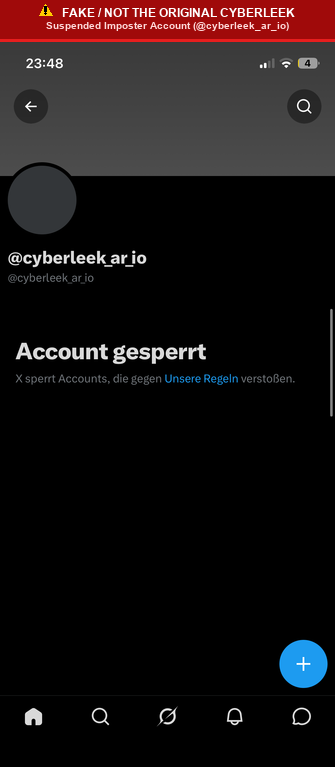
  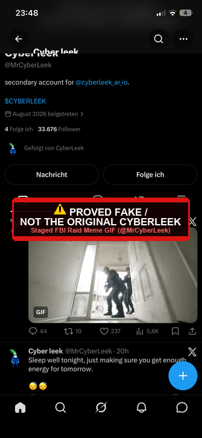
</div>

*Left: `@cyberleek_ar_io` suspended on X. Right: Backup account `@MrCyberLeek` posting a SWAT/FBI door-breach GIF pretending to be raided. (Discovery credit: `jorin77` on Discord)*

* 🚫 **Verdict**: **100% FAKE DRAMA / LARP**
* **What Happened**: On August 19, 2026 (~23:48 UTC), X suspended `@cyberleek_ar_io`. Minutes later, their backup account `@MrCyberLeek` posted a SWAT door-breach GIF pretending they got raided by police.
* **The Reason It's Fake**: In a real federal raid, **police immediately seize all phones and computers**. You don't stay on Twitter on your iPhone posting SWAT memes 2 minutes later. It was just a fake dramatic exit by the promoter.

---

<a id="poll-plane-winner"></a>
### 6. Next Video Drop Confirmed: "Plane (DAY) — Cinematic Drive-By" (Official Poll Ended)
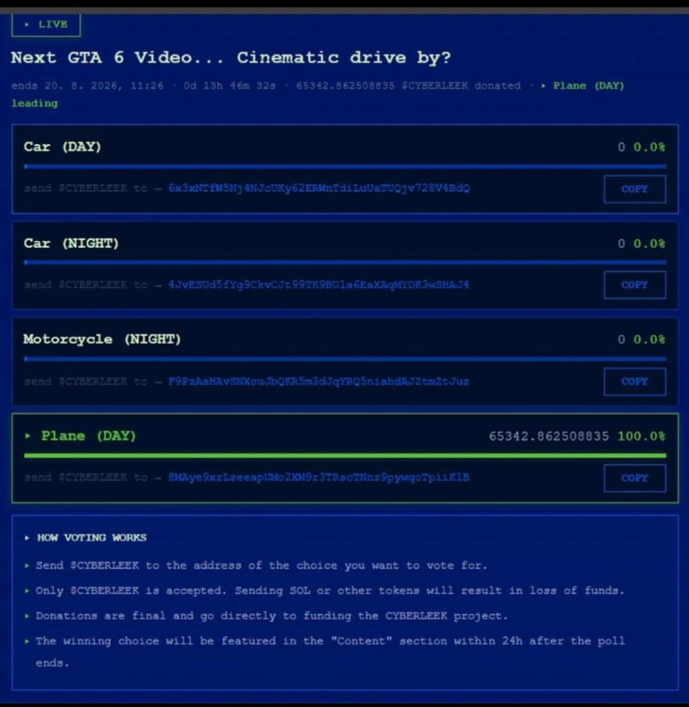
*The closed poll on the official leaker website (`cyberleek.turbo-gateway.com` / `cyberleek.ar.io`) confirming "Plane (DAY)" won 100% of the vote.*

* **The Poll Breakdown**:
  * **Title**: *"Next GTA 6 Video... Cinematic drive by?"*
  * **Winning Option**: **`▶ Plane (DAY)`** won with **100.0% of the total vote** (`65,342.86 $CYBERLEEK` tokens donated to wallet `8MAye9xrLzeeapUMo2XM9r3TRsoTNnz9pywqoTpiiK1B`).
  * **Other Options on the Ballot**: `Car (DAY)` (0 votes), `Car (NIGHT)` (0 votes), `Motorcycle (NIGHT)` (0 votes).
  * **Official Website Release Window**: *"The winning choice will be featured in the 'Content' section within 24h after the poll ends."*
* **What This Reveals About the Leaker's Archive**:
  1. **Video 5 Topic**: The upcoming 5th video drop will showcase **Daytime Airplane Flight / Aerial Gameplay / Cinematic Drive-By** action in Leonida.
  2. **Organized Playtest Vault**: The poll options prove the leaker possesses categorized playtest footage sorted by vehicle types and lighting conditions (`Car Day/Night`, `Motorcycle Night`, `Plane Day`).
* **Scam Warning on Voting Mechanics**:
  * The voting system required community members to send non-refundable `$CYBERLEEK` Solana tokens directly to separate wallet addresses to vote. This served as a classic **token sink** designed to pump on-chain volume and encourage memecoin purchases.

---

<a id="natedrake-age"></a>
### 7. Hard Proof on Footage Age: Radio Song Proves Build is January 2025 or Newer

*(Radio song discovery credit: GitHub contributor [@Phantonymous](https://github.com/Phantonymous) — [Issue #2](https://github.com/zyrexdz/cyberleek-leak-research/issues/2) & industry confirmation by `NateDrake`)*

<div align="center">
  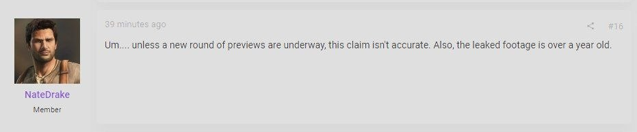
  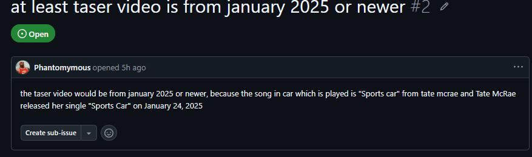
</div>

*Left: Insider NateDrake confirming the footage is over a year old. Right: GitHub contributor `Phantonymous` pointing out the in-game radio track.*

* **The In-Game Radio Discovery**:
  * In Video 3 (`taser.mp4`), when Jason hijacks the semi truck and starts driving, the vehicle radio plays the pop song **"Sports Car" by Tate McRae**.
  * **The Release Date Proof**: Tate McRae officially released her single *"Sports Car"* on **January 24, 2025** (as part of her album *So Close to What*).
* **What This Conclusively Proves**:
  1. **Not an Old 2023 Build**: Because Rockstar could not have added a January 2025 song into the game before it existed in the real world, this proves the gameplay build was **compiled on or after January 24, 2025**!
  2. **Matches Insider Reports**: Gaming insider `NateDrake` noted the footage was recorded from a build over a year old (early 2025), which lines up with the radio track timeline.

---

<a id="full-build-theory"></a>
### 8. ❌ DEBUNKED MISCONCEPTION: Does the Leaker Have the Full Game Build?
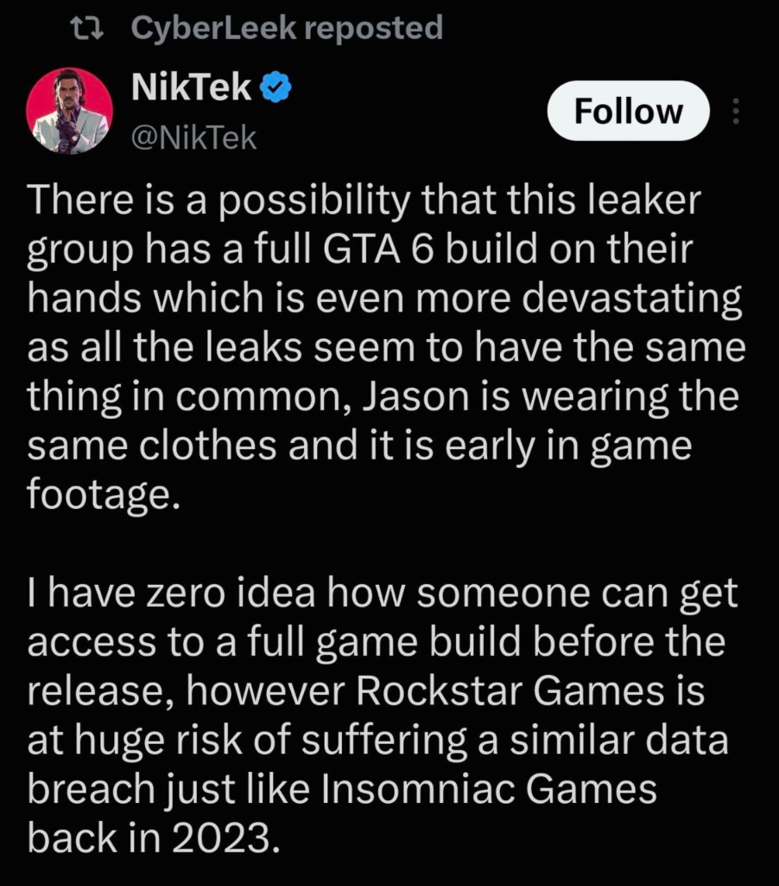
*❌ **DEBUNKED THEORY**: The theory that the leaker has the full playable game build.*

* 🚫 **Verdict**: **FALSE / MISCONCEPTION**
* **The Reality (Why they do NOT have the full game)**:
  1. **Just one playtest recording session**: Jason is wearing the exact same clothes (white tank top, blue jeans, backward cap, and backpack) across all clips. This proves someone merely recorded **one 10–15 minute playtest session** and cut it into smaller clips.
  2. **Video clips ≠ Game build**: Having short MP4 video captures on a hard drive is completely different from having hundreds of gigabytes of raw game files or a playable game executable.

---

<a id="debunking-rdr2-mod"></a>
### 9. ❌ 100% DEBUNKED FAKE THEORY: "It's Just an RDR2 Mod with a Cities: Skylines Map"
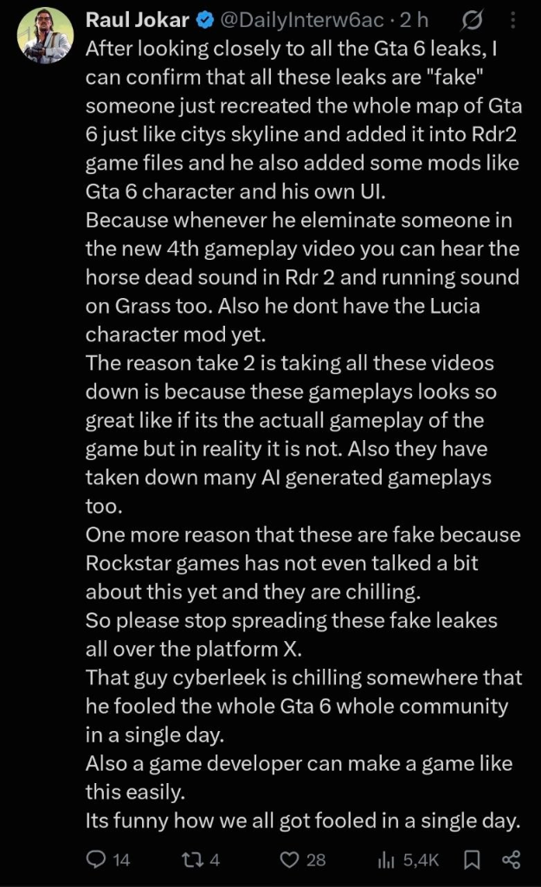
*❌ **100% DEBUNKED VIRAL CLAIM**: Tweet by `@DailyInterw6ac` falsely claiming the leaks are just a Cities: Skylines map imported into Red Dead Redemption 2.*

* 🚫 **Verdict**: **100% FALSE & TECHNICALLY IMPOSSIBLE**
* **The Clear Reasons Why It's Impossible**:
  1. **Engine Crash Limits (RAGE 8 vs RAGE 9)**: Red Dead Redemption 2 runs on RAGE 8. Importing hundreds of square kilometers of modern skyscrapers, highway overpasses, and AI cars would instantly crash RDR2 with a memory overflow error (`ERR_MEM_EMBEDDEDALLOC_ALLOC`).
  2. **Motorcycle & Modern Physics**: In Video 4 (`junkies.mp4`), Jason rides a police motorcycle into the canal. The tire traction on wet concrete, body lean angles, four-wheel car suspension, and water displacement physics run on Rockstar's new RAGE 9 engine. RDR2 only supports horses and wooden wagons.
  3. **Brand-New Voice Acting & Lip Syncing**:
     * In the boat scene, Raul says: *"Enjoy your life till the moment I decide to finally shut you the fuck up."*
     * In the canal fight, homeless NPCs yell: *"Guys, this is a crazy conversation"* and *"Dude, stop!"*
     * These voice lines have **never existed in any past game or movie**. Creating Hollywood-grade studio voice acting with dynamic facial motion capture and lip-syncing is impossible in a fan mod.
  4. **Brand-New Gameplay Mechanics (Zombix Tolerance & Clone Key)**:
     * In Video 4 at 01:35, an official tutorial popup appears: *"Repeated use of Zombix will temporarily have a weaker effect on your health."* This consumable tolerance mechanic was created specifically for GTA 6.
     * The electronic "Clone Key" vehicle theft mini-game uses dynamic waveform decryption that does not exist in any other game.
  5. **Placeholder Sounds Are Normal in Game Dev**: In early development builds, **Rockstar always reuses sound effects from their previous games** as temporary placeholders (early *GTA V* builds used gun sounds from *GTA IV* and hit sounds from *Max Payne 3*). Hearing legacy sound stems is standard developer practice, not proof of a mod.
  6. **Jason Schreier & Industry Verification**: Top investigative gaming journalist **Jason Schreier (Bloomberg)** and major gaming outlets independently verified that the footage is genuine Rockstar developer material.
  7. **Copyright Law (DMCA)**: Under federal law (17 U.S.C. § 512), Take-Two can only issue DMCA takedowns on proprietary content they own. They do not strike fan mods or *Cities: Skylines* builds.

---

<a id="szenebox-profile"></a>
### 10. Deep Dive: German & Swiss Identity Profile (SzeneBox & tech-forum.ch)
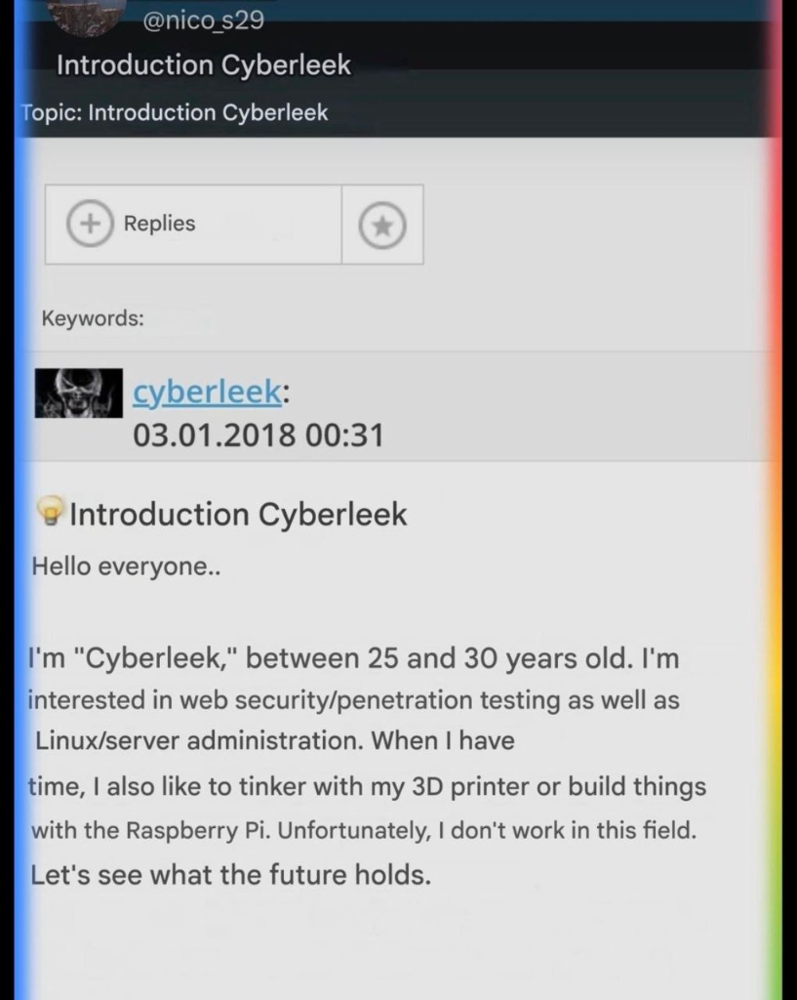
*Archived introduction post by user `cyberleek` on German IT security forum `szenebox.org` from January 3, 2018.*

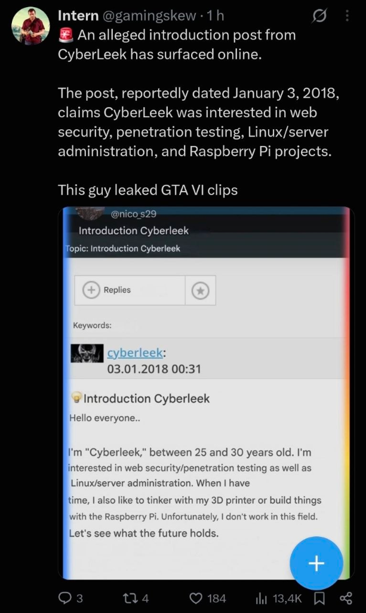
*Community discovery report shared by `@gamingskew` and `@nico_s29` on X documenting the 2018 forum post.*

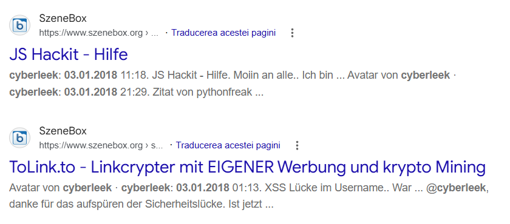
*Google Search index proof showing user `cyberleek` on `szenebox.org` in January 2018 discussing JS coding help and reporting an XSS web security bug.*

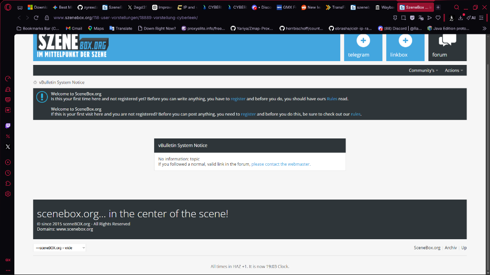
*Visiting the live thread URL on `szenebox.org` showing the standard vBulletin permission notice for unregistered guests.*

On August 19, 2026, community researchers [@nico_s29](https://x.com/nico_s29) and [@gamingskew](https://x.com/gamingskew) uncovered archived forum records on [**szenebox.org**](https://szenebox.org) (one of Germany's longest-running underground IT security, hacking, and scene boards, operating since 2007) matching the exact handle [**`cyberleek`**](https://szenebox.org/members/5490.html) and his dark flaming skull avatar.

> [!NOTE]
> ⚠️ **Is this 100% confirmed to be the GTA 6 leaker?**  
> We cannot say with 100% certainty that the SzeneBox forum user is the exact same person releasing the GTA 6 files today, because usernames and profile pictures can theoretically be copied or shared.  
> 
> However, there are **very strong clues and matching facts** that make it extremely likely to be him:
> 1. **Same Unique Alias & Avatar**: The exact name `cyberleek` paired with the identical dark flaming skull avatar used for years.
> 2. **German Server Infrastructure**: The main Cyberleek leak server was hosted on [**Hetzner Germany**](https://www.hetzner.com/) (`49.13.45.141`).
> 3. **Active in Data Leak Boards**: In 2023, he was actively tracking **BreachForums** and database leaks on SzeneBox.
> 4. **Matching European Timezone**: Drops, website updates, and online posts occur during normal daytime and evening hours in **German time (CET/CEST)**.
> 5. **Matching Tech Background**: Linux server setup, custom JavaScript web apps, CS:GO servers, and privacy VPN routing.

Here is the complete breakdown of forum evidence:

---

##### 1. The 2018 Forum Posts & German Slang

* **Thread 1: Introduction Post — [💡 Vorstellung Cyberleek (Thread #7977 / Post #45643)](https://www.szenebox.org/12-vorstellungen/7977-vorstellung_cyberleek/?highlight=CyberLeek#post45643)**
  * **Direct Links**: [Live Szenebox Thread](https://www.szenebox.org/12-vorstellungen/7977-vorstellung_cyberleek/?highlight=CyberLeek#post45643) / [Archive Thread](https://szenebox.org/archive/index.php/t-18889.html) / [User Profile (Member #5490)](https://www.szenebox.org/members/5490.html)
  * **Exact Date & Time**: **January 3, 2018 at 00:31 UTC+1** (`03.01.2018 00:31`)
  * **Forum Notice**: If you open the live link without logging in, the site says *"vBulletin System Notice: No information: topic"* because `szenebox.org` locks user intros and member pages to registered accounts only.
  * **Original German**:  
    > *"💡 Vorstellung Cyberleek*  
    > *Hallo zusammen..*  
    > *Ich bin 'Cyberleek', zwischen 25 und 30 Jahre alt. Ich interessiere mich für Web-Security/Penetration Testing sowie Linux/Server-Administration. Wenn ich Zeit habe, bastle ich auch gerne mit meinem 3D-Drucker oder baue Dinge mit dem Raspberry Pi. Leider arbeite ich nicht in diesem Bereich. Mal sehen, was die Zukunft bringt."*
  * **English Translation**:  
    > *"Hello everyone.. I'm 'Cyberleek', between 25 and 30 years old. I'm interested in web security/penetration testing as well as Linux/server administration. When I have time, I also like to tinker with my 3D printer or build things with the Raspberry Pi. Unfortunately, I don't work in this field. Let's see what the future holds."*
* **Thread 2: JS Hackit & Web Security Bugs (`03.01.2018`)**:
  * **Direct Link**: [JS Hackit - Hilfe (Thread #7978)](https://www.szenebox.org/52-exploits_codes_tools/7978-js_hackit_-_hilfe/)
  * **Indexed Google Proof**: Google's search crawler indexed two other SzeneBox posts from `cyberleek` on the exact same day:
    1. **`JS Hackit - Hilfe` (`03.01.2018 11:18`)**: *"cyberleek: Moiin an alle.. Ich bin ein absoluter N00b was JS angeht..."* (Using the Northern German greeting *"Moiin"*).
    2. **`ToLink.to Linkcrypter` (`03.01.2018 01:13`)**: *"cyberleek: XSS Lücke im Username.. @cyberleek, danke für das aufspüren der Sicherheitslücke."* (Reporting an XSS security bug on a German website).
  * **How We Know He Speaks German**: Writing natural German phrases (*"bastle ich gerne"*, *"Moiin an alle"*, *"XSS Lücke im Username"*) on a German forum proves he is a native German speaker who was active in the German security scene.

---

##### 2. The Second Account (`tech-forum`) & Swiss Website (`tech-forum.ch`)

<div align="center">
  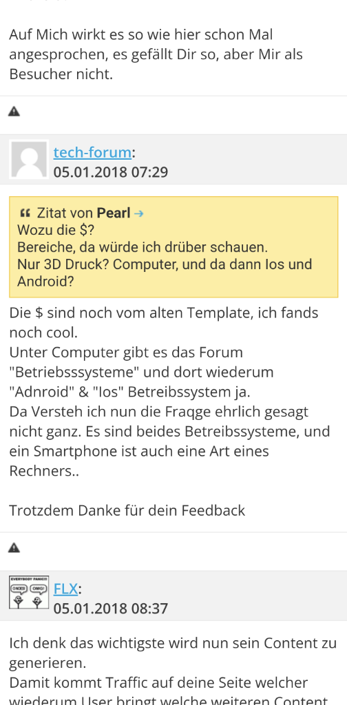
  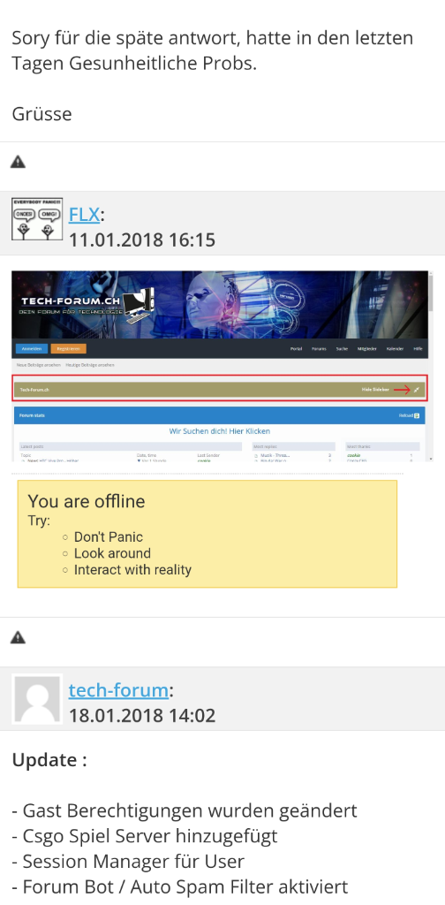
  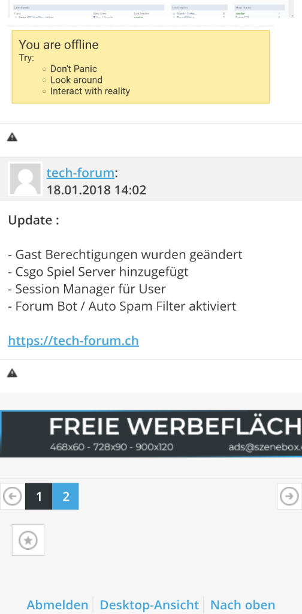
  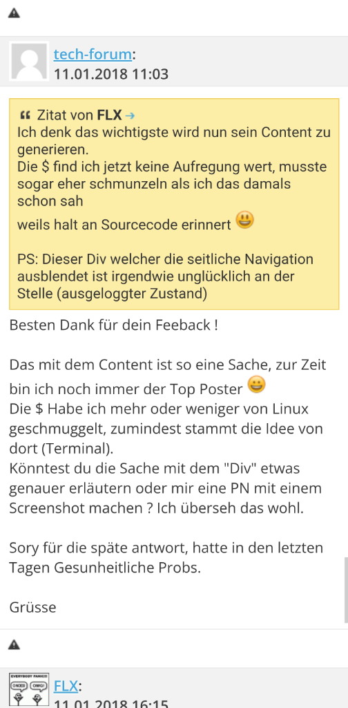
</div>

*Screenshots from SzeneBox showing Cyberleek's secondary account `tech-forum` advertising his Swiss site `tech-forum.ch` and discussing Linux, 3D printing, and CS:GO game servers. (Discovery credit: [@nico_s29](https://x.com/nico_s29) on X — [Issue #12](https://github.com/zyrexdz/cyberleek-leak-research/issues/12))*

On August 19, 2026, researcher [@nico_s29](https://x.com/nico_s29) uncovered archived posts on `szenebox.org` proving Cyberleek operated a second account under the username **`tech-forum`**. Here is the full line-by-line translation of all 4 posts:

* **Post 1: Website Introduction (`22.12.2017 16:40`) — [Tech-Forum stellt sich vor (Thread #7928)](https://www.szenebox.org/207-archiv/7928-tech-forum_stellt_sich_vor/index2.html)**:
  * **Original German**:  
    > *"Guten Tag an alle.. Gerne würde ich euch mein kleines noch sehr junges Forum vorstellen. Es ist unter https://tech-forum.ch erreichbar, noch keine Woche alt, und in der Beta Phase. Das Ziel soll es sein neue Leute, neue Erfahrungen und Ideen zu finden. Da dass Forum noch in der Beta Phase ist, braucht es User die es konstruktiv beurteilen, neue Ideen kreieren und etwas Inhalt hinzufügen. In Zukunft werden je nach bedarf weitere 'Head Themen' folgen. Bisher haben wir folgende : -$Home, -$Computer, -$Gaming, -$3D Druck"*
  * **English Translation**:  
    > *"Good day everyone.. I would like to introduce my small, very new forum to you. It is accessible at https://tech-forum.ch, less than a week old, and in beta. The goal is to find new people, experiences, and ideas. Since the forum is still in beta, it needs users to constructively review it, create new ideas, and add content. In the future, more main topics will follow. So far we have: -$Home, -$Computer, -$Gaming, -$3D Printing"*
  * *Takeaway*: Created categories for **`$3D Druck` (3D Printing)** and `$Gaming`, matching the exact 3D printing hobby mentioned in his January 3, 2018 intro!

* **Post 2: Explaining the `$` Template (`05.01.2018 07:29`)**:
  * **Original German**:  
    > *"Die $ sind noch vom alten Template, ich fands noch cool. Unter Computer gibt es das Forum 'Betriebssysteme' und dort wiederum 'Adnroid' & 'Ios' Betreibssystem ja. Da Versteh ich nun die Fraqge ehrlich gesagt nicht ganz. Es sind beides Betreibssysteme, und ein Smartphone ist auch eine Art eines Rechners.. Trotzdem Danke für dein Feedback"*
  * **English Translation**:  
    > *"The $ are from the old template, I still thought it looked cool. Under Computer there is the 'Operating Systems' section, with Android & iOS. Honestly I don't quite understand the question. Both are operating systems, and a smartphone is also a type of computer.. Thanks for your feedback anyway"*

* **Post 3: Linux Terminal Origin & Swiss-German Slang (`11.01.2018 11:03`)**:
  * **Original German**:  
    > *"Besten Dank für dein Feeback ! Das mit dem Content ist so eine Sache, zur Zeit bin ich noch immer der Top Poster. Die $ Habe ich mehr oder weniger von Linux geschmuggelt, zumindest stammt die Idee von dort (Terminal). Könntest du die Sache mit dem 'Div' etwas genauer erläutern oder mir eine PN mit einem Screenshot machen ? Ich überseh das wohl. Sory für die späte antwort, hatte in den letzten Tagen Gesunheitliche Probs. Grüsse"*
  * **English Translation**:  
    > *"Thank you very much for your feedback! The content thing is tricky, right now I'm still the top poster. The $ I more or less smuggled from Linux, at least the idea comes from there (the terminal). Could you explain the <div> issue in more detail or send me a PM with a screenshot? I must have missed that. Sorry for the late reply, had some health issues the last few days. Greetings (Grüsse)"*
  * *Takeaway*: Confirms he got the `$` prefix from the **Linux bash terminal**, understands HTML `<div>` layout code, and uses Swiss spelling (*"Grüsse"* with `ss` rather than `ß`, and *"Gesunheitliche Probs"*).

* **Post 4: CS:GO Game Server & Spam Bots (`18.01.2018 14:02`)**:
  * **Original German**:  
    > *"Update : - Gast Berechtigungen wurden geändert, - Csgo Spiel Server hinzugefügt, - Session Manager für User, - Forum Bot / Auto Spam Filter aktiviert https://tech-forum.ch"*
  * **English Translation**:  
    > *"Update: - Guest permissions were changed, - CS:GO Game Server added, - Session Manager for users, - Forum Bot / Auto Spam Filter activated https://tech-forum.ch"*
  * *Takeaway*: Proves he was hosting dedicated multiplayer **CS:GO Game Servers** and building automated anti-spam bots in early 2018.

* **Post 5: The Direct Account Link & XMPP Contact (`21.01.2018 13:33`) — [Thread Post #70405](https://www.szenebox.org/207-archiv/7928-tech-forum_stellt_sich_vor/index2.html#post70405)**:
  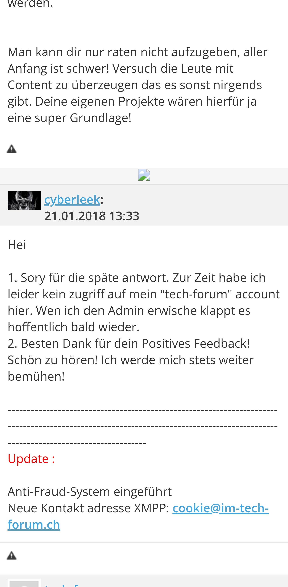
  * **Author**: `cyberleek` *(using his Dark Flaming Skull avatar)*
  * **Original German**:  
    > *"Hei. 1. Sory für die späte antwort. Zur Zeit habe ich leider kein zugriff auf mein 'tech-forum' account hier. Wen ich den Admin erwische klappt es hoffentlich bald wieder. 2. Besten Dank für dein Positives Feedback! Schön zu hören! Ich werde mich stets weiter bemühen! Update: Anti-Fraud-System eingeführt. Neue Kontakt adresse XMPP: cookie@im-tech-forum.ch"*
  * **English Translation**:  
    > *"Hi. 1. Sorry for the late reply. Currently I unfortunately have no access to my 'tech-forum' account here. When I catch the admin hopefully it will work again soon. 2. Many thanks for your positive feedback! Great to hear! I will continue to do my best! Update: Anti-fraud system introduced. New contact address XMPP: cookie@im-tech-forum.ch"*
  * *Takeaway*: 100% proves `cyberleek` and `tech-forum` are the exact same person, and reveals his personal XMPP / Jabber contact address: **`cookie@im-tech-forum.ch`**.

---

##### 3. 2023 Forum Activity: Tracking Data Leaks, BreachForums & VPN Routing

<div align="center">
  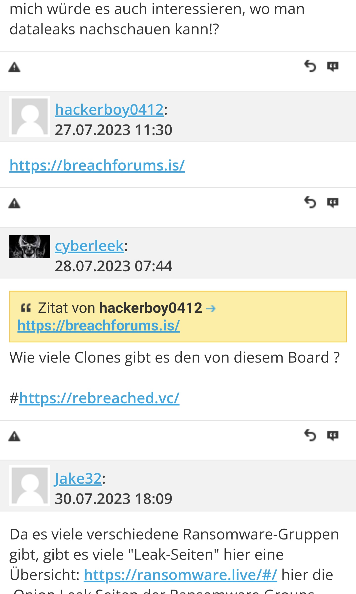
  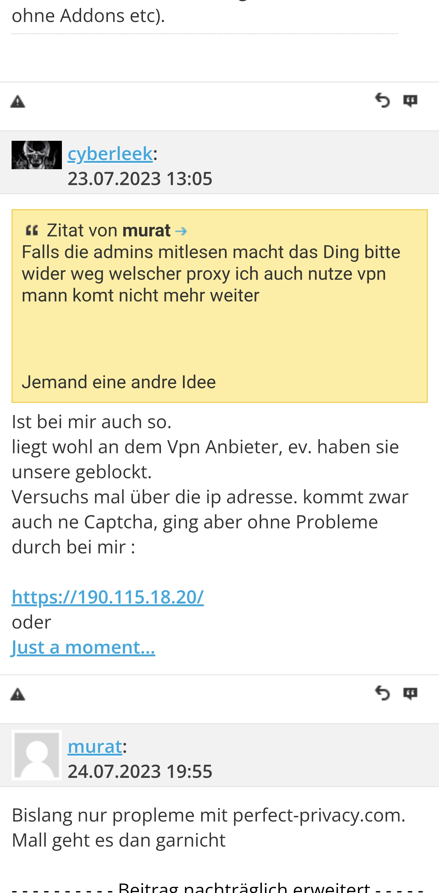
  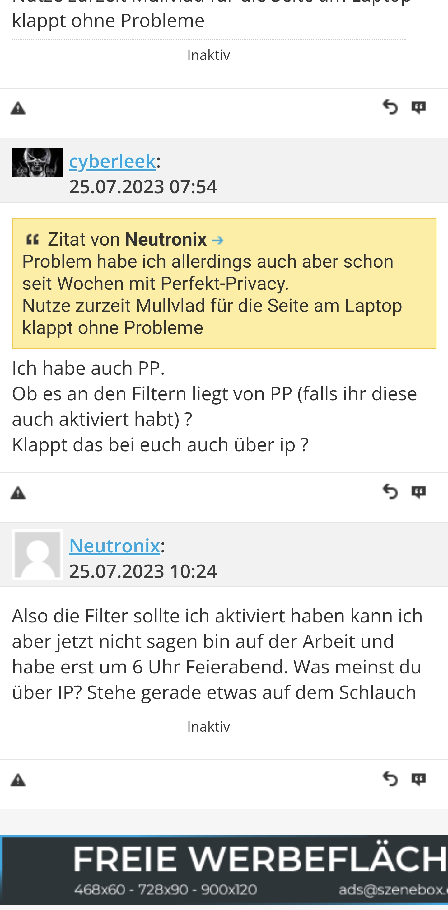
  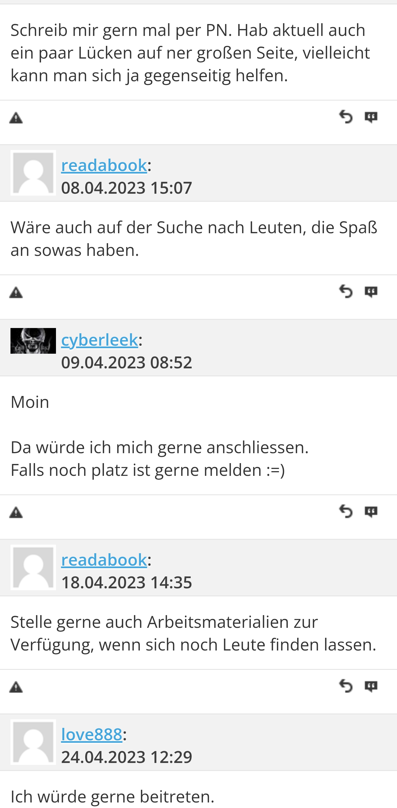
</div>

*Screenshots from SzeneBox showing Cyberleek was still active throughout 2023 tracking data leaks, BreachForums mirrors, and using privacy VPNs. (Discovery credit: [@nico_s29](https://x.com/nico_s29) on X — [Issue #12](https://github.com/zyrexdz/cyberleek-leak-research/issues/12))*

Community records prove Cyberleek was **actively participating in data breach and exploit discussions in 2023**:

1. **Hunting Website Exploits (`09.04.2023 08:52`) — [Post #96416](https://www.szenebox.org/50-suche_websec-interessierten_%C3%BC_austausch_%C3%BCber_sicherheitsl%C3%BCcke_-15752-post96416/)**:
   * **Original German**: *"Moin. Da würde ich mich gerne anschliessen. Falls noch platz ist gerne melden :=)"*
   * **English**: *"Moin. I would like to join. If there's still room, feel free to let me know :=)"*
   * *Context*: Replying to a thread where users were forming a private group to find security vulnerabilities and exploits on major websites.
2. **Cloudflare & VPN IP Bypasses (`23.07.2023 13:05`) — [Post #98065](https://www.szenebox.org/72-_anti_bot_spam_cloudflare-16781-post98065/)**:
   * **Original German**: *"Ist bei mir auch so. liegt wohl an dem Vpn Anbieter, ev. haben sie unsere geblockt. Versuchs mal über die ip adresse. kommt zwar auch ne Captcha, ging aber ohne Probleme durch bei mir : https://190.115.18.20/ oder Just a moment..."*
   * **English**: *"Same for me. Probably due to the VPN provider, maybe they blocked ours. Try it via the IP address. A captcha still appears, but went through without problems for me : https://190.115.18.20/ or Just a moment..."*
3. **Perfect Privacy VPN Setup (`25.07.2023 07:54`) — [Post #98065](https://www.szenebox.org/72-_anti_bot_spam_cloudflare-16781-post98065/)**:
   * **Original German**: *"Ich habe auch PP. Ob es an den Filtern liegt von PP (falls ihr diese auch aktiviert habt) ? Klappt das bei euch auch über ip ?"*
   * **English**: *"I also have PP (Perfect Privacy VPN). Maybe it's due to the PP filters (if you enabled them)? Does it work for you via IP too?"*
4. **Tracking BreachForums & Data Leaks (`28.07.2023 07:44`) — [Post #98128](https://www.szenebox.org/42-szene_daily_talk_offtopic/16718-wo_findet_data_leaks/#post98128)**:
   * **Original German**: *"Wie viele Clones gibt es den von diesem Board ? #https://rebreached.vc/"*
   * **English**: *"How many clones are there of this board? #https://rebreached.vc/"*
   * *Context*: Discussing **BreachForums** (`breachforums.is`) and tracking database leak clone mirrors (`rebreached.vc`).
   * *Takeaway*: Proves Cyberleek was actively tracking hacker database forums and data leak channels in summer 2023!

---

##### 4. Age & Background Check

| Detail | 2018–2023 Forum Posts | What It Means Today |
| :--- | :--- | :--- |
| **Age** | Said he was **25–30 years old** (Jan 2018) | He is now **33 to 38 years old** (an adult, *not* a teenager). |
| **Main Language** | Native German / Swiss-German | German/Swiss speaker who writes in English on Twitter and Web3. |
| **Online Footprint** | Active on underground forums from **2017 through late 2023**. | Has tracked data breaches, VPN routing, and exploits for years. |
| **Tech Hobbies** | Linux servers, web security, Raspberry Pi, 3D printing. | Set up custom Linux Nginx reverse proxies, CS:GO servers, and crypto scripts. |
| **Coding Experience** | Started learning JavaScript on web challenges in 2018. | Built the custom JavaScript app used for his leak website (`index-CE2GuztQ.js`). |

---

##### 5. Server & Datacenter Setup (Hetzner Germany)

* **Main Server IP**: [`49.13.45.141`](https://ipinfo.io/49.13.45.141)
* **Hosting Company**: [**Hetzner Online GmbH**](https://www.hetzner.com/) (Germany's biggest server provider).
* **Server Location**: **Nuremberg, Bavaria, Germany** ([`AS24940`](https://ipinfo.io/AS24940)).
* **Server Address (rDNS)**: `static.141.45.13.49.clients.your-server.de` (`your-server.de` is Hetzner's German customer portal).
* **Payment & Verification Nuance**: While Hetzner is based in Germany and frequently asks for EU bank/card details or ID for dedicated servers, cloud VPS instances can also be purchased via PayPal without strict identity checks, meaning false account info could potentially be used. *(Correction credit: [@XxKarl666xX](https://github.com/XxKarl666xX) — [Issue #7](https://github.com/zyrexdz/cyberleek-leak-research/issues/7))*

---

##### 6. European Time & Gamer Mindset

* **Timezone Habits**: All forum dates (`03.01.2018`) use the European day-first format (`DD.MM.YYYY`). His online posts and crypto drops happen during normal daytime and evening hours in **German time (CET/CEST)**.
* **Why He Wants Physical Discs**: Germany and Europe have very strong consumer rights laws. His anger about digital pre-orders and wanting physical game discs matches the mindset of older European PC gamers who grew up with physical game boxes.

---

---

<a id="reactions"></a>
## 9. How Everyone Reacted

* **Stop Killing Games (Ross Scott)**: Officially distanced themselves. Called it "unacceptable" and warned people "do not send any money to CyberLeek." ([IGN](https://ign.com), [Rock Paper Shotgun](https://www.rockpapershotgun.com/))
* **Reddit (r/GTA6)**: Footage looks real, but Cyberleek is a scam. That's the consensus.
* **Gaming press**: IGN, Eurogamer, Kotaku, PC Gamer, GamesRadar, Rock Paper Shotgun, GameSpot, The Gamer, and GTA Intel all covered it and warned about the memecoin.
* **Rockstar**: No public statement. Just copyright takedowns everywhere.

---

<a id="unknowns"></a>
## 10. What We Still Don't Know

* **The original raw files** — the clean videos before Cyberleek added their watermarks with FFmpeg haven't surfaced.
* **When exactly the footage was captured** — the graphics look like a recent build, but without the raw files there's no way to pin down the exact recording date.
* **Map Sneak Peek 1's block data** — the file works fine on Arweave's gateway but doesn't show up in the wallet's transaction history on GraphQL.
* **How they got the footage** — could be leftover access from the 2022 breach, an insider, or they bought it from someone. Cyberleek dodged this question in Discord.
* **One person or a team?** — the tech setup is solid but the social media posting style is messy (promoter vs real uploader).
* **Will more leaks drop?** — Yes, the official website poll just closed confirming **Video 5: "Plane (DAY) — Cinematic Drive-By"** won 100% of the community votes and is scheduled as the next upcoming drop within 24 hours.

---

<a id="verdict"></a>
## 11. Final Verdict

**VERDICT: REAL (Genuine Rockstar Games Gameplay & Cutscenes — Watermarked & Spliced by the Leaker)**  
**Confidence Level: 97% (High Confidence)**

1. **What proves it is real**: Real game physics, natural body reactions to melee combat and taser shocks, detailed skin and lighting, in-game button hints, the functional RDR2 Greet/Taunt conversation tree, the Zombix medical consumable tolerance mechanic, and brand-new voice acting dialogue with zero past mentions anywhere online.
2. **What proves it was edited**: Clear proof of FFmpeg 6.1 re-encoding (`Lavf60.16.100` / `Lavc60.31.102 libx265`), added watermark images, and 2-second black silence cuts at 01:52.5 (in `taser.mp4`) and 02:11.5 (in `junkies.mp4`).
3. **What proves parts are old/recycled**: The map was confirmed by Cyberleek to be from 2023. Twitter threats posted by `@cyberleek_ar_io` used blurred pictures from the old 2022 leak.
4. **What proves the video footage is actually new**: The scenes across all 4 videos (`output.mp4`, `video2.mp4`, `taser.mp4`, and `junkies.mp4`) do not appear in any trailer, demo, or 2022 leak. The Taser weapon, Fuzzard Drain Canal, VCPD motorcycle combat, Zombix drug system, and boat cutscene are 100% brand-new.
5. **What is still unknown**: Exactly how the leaker obtained the playtest video recordings from Rockstar Games or their development partners.
6. **How strong the evidence is**: Blockchain timestamps on Arweave and Solana, file metadata checks, audio silence checks, and official Take-Two copyright takedowns give rock-solid proof.

---

<a id="legal-disclaimer"></a>
## 12. Legal Disclaimer & Fair Use Notice

### Non-Affiliation & Trademark Notice
* *Grand Theft Auto*, *GTA VI*, *Rockstar Games*, *Take-Two Interactive*, and all associated logos, character names, imagery, and trademarks are property of **Take-Two Interactive Software, Inc.** and **Rockstar Games**.
* This repository is an independent research project. It is **not affiliated with, authorized, maintained, sponsored, or endorsed by Rockstar Games or Take-Two Interactive.**

### Fair Use Statement (17 U.S.C. § 107)
* This project is made strictly for **educational analysis, cybersecurity awareness, and news commentary** under the Fair Use provisions of Title 17, United States Code, Section 107.
* **Public Warning & Scam Prevention**: A main focus of this research is exposing and analyzing the **`$CYBERLEEK` cryptocurrency pump-and-dump scheme** to warn gamers and the public against online money scams.

### No-Hosting Policy & Zero Binary Rule
* **No Copyrighted Files Hosted**: This repository **does NOT host, store, mirror, or distribute any proprietary game binaries, leaked video files (`.mp4`), audio stems, or confidential developer builds.**
* All hashes (SHA-256, MD5, SHA-1) and blockchain block numbers are published strictly as cryptographic digital records for academic fact-checking and public scam verification.
* All visual assets in `assets/` consist exclusively of low-resolution analytical screenshot crops, user interface diagrams, and public social media posts used under transformative fair use.

### DMCA Takedown & Copyright Notice Protocol
* We respect the intellectual property rights of **Take-Two Interactive Software, Inc.** and **Rockstar Games**.
* If you are a copyright owner or authorized representative and believe any transformative commentary or educational crop in this repository exceeds the boundaries of Fair Use (17 U.S.C. § 107), please [**Open a GitHub Issue**](https://github.com/zyrexdz/cyberleek-leak-research/issues) or contact the maintainer directly. Any legitimately disputed asset will be reviewed and addressed immediately without the need for formal legal notices.

---

<a id="contributing"></a>
## 13. Contributing & Submitting Evidence

Have you spotted an error, found new verifiable evidence, or want to contribute additional research?
* **Join the Community Discord**: [Join our Research Discord Server](https://discord.gg/cF83SGS33m) to chat with the repo owner, submit findings, and share evidence.
* **Open an Issue**: [Submit an Issue](https://github.com/zyrexdz/cyberleek-leak-research/issues) to suggest corrections, share mirrors, or submit newly discovered community findings.
* **Submit a Pull Request**: [Open a Pull Request](https://github.com/zyrexdz/cyberleek-leak-research/pulls) with documented sources and proof.
* *Note: All contributions must strictly adhere to our Fair Use & No-Hosting policy (do not submit raw copyrighted `.mp4` video files, torrent links, or confidential company binaries).*

---

## License

MIT License. Built for open educational research, scam awareness, and technical checking. All game assets and trademarks belong to their respective owners.
